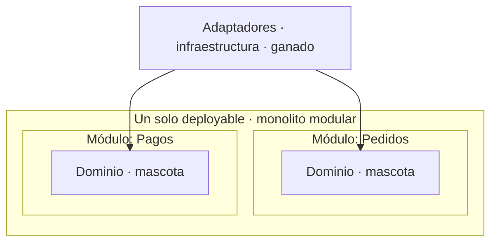

Cada vez que un equipo grande anuncia que volvió al monolito, el titular es el mismo: "los microservicios fracasaron". Y cada vez, es la lección equivocada.

Los datos del backlash son reales: más del 40% de las organizaciones se arrepiente de al menos algunas de sus decisiones de microservicios. Facturas de nube que se dispararon, complejidad operativa, equipos agotados de mantener veinte deployables para un producto que tiene tres usuarios concurrentes. Todo eso pasó y está bien documentado.

El problema es la conclusión que se saca. Se lee como si hubiera fracasado el **buen diseño**. Y lo que fracasó fue otra cosa: la **complejidad operativa** que la gente creyó que venía incluida con el buen diseño.

En el medio, DDD quedó en la misma bolsa. "Eso de los bounded contexts y los agregados era cosa de la época de los microservicios." No. Y quiero explicar por qué, porque la confusión te puede costar años.

## DDD nunca fue sobre microservicios

DDD no es una arquitectura de despliegue. No te dice en cuántas cajas corre tu sistema. Te dice **cómo pensás el problema antes de escribir una línea**.

El corazón de DDD es una sola idea, y es más vieja que los microservicios: separá lo que es el negocio de lo que es el plumbing. Las reglas que hacen que tu sistema haga lo que el negocio necesita, por un lado. La forma técnica en que eso se acciona —la base de datos, las colas, los proveedores externos—, por el otro.

Esa separación no necesita microservicios. Nunca los necesitó. Los microservicios fueron **una** manera de forzar esos límites, la más cara y la más ruidosa. Pero confundir la disciplina con la topología de despliegue es como creer que sos ordenado porque tenés muchos cajones. Los cajones no te ordenan. La disciplina, sí.

## El dominio es mascota; todo lo demás es ganado

Ya escribí antes que hay que dejar de romantizar el código: **es ganado, no una mascota.** Quiero llevar esa idea hasta el fondo, porque acá es donde se vuelve una decisión de arquitectura y no una frase linda.

No todo el código es ganado. Hay exactamente una parte que es mascota, y es el dominio.

**El dominio es lo único irregenerable.** Son las reglas del negocio: las entidades, las invariantes, las decisiones que hacen que tu sistema valga algo. Eso no está escrito en ningún otro lado. Si lo perdés, no lo recuperás pidiéndoselo a nadie, porque es conocimiento del negocio convertido en código. Se protege, se piensa despacio, se cambia con cuidado.

**Todo lo demás es ganado.** Los adaptadores, las integraciones, la infraestructura, la capa que habla con el proveedor de turno: reemplazable, desechable, regenerable. Si mañana hay una forma mejor de hacerlo, se tira y se hace de nuevo. No pasa nada. Justamente para eso separás las capas.

Y la herramienta que hace esa distinción concreta —no filosófica, sino ejecutable— es la arquitectura de **puertos y adaptadores** (lo que mucha gente conoce como hexagonal). El puerto es el límite: el dominio dice *qué* necesita, sin enterarse de *cómo* se cumple. El adaptador es el ganado del otro lado del puerto.

## La IA subió la apuesta

Acá es donde esta vieja disciplina se vuelve, de golpe, más urgente que nunca.

Los números del código asistido por IA ya están sobre la mesa, y no son sutiles. Un análisis de 8,1 millones de pull requests encontró que la deuda técnica sube entre 30% y 41% después de que un equipo adopta herramientas de IA. El código asistido tiene 1,7 veces más problemas que el escrito a mano. El churn —código que se escribe y se borra en menos de dos semanas— saltó de un tercio a casi dos quintos del código nuevo. Y entre el 30% y el 40% de los snippets generados traen alguna vulnerabilidad conocida.

La lectura fácil es "entonces la IA escribe mal código". La lectura útil es otra: **la IA produce ganado a una velocidad que antes no existía.** Barato, rápido, y desprolijo en los bordes —el manejo de errores, los edge cases, la seguridad—, que es exactamente donde la deuda se esconde.

Ahora juntá las dos ideas. Si tus bordes están detrás de puertos, esa deuda cae en ganado. Queda contenida en la parte que ya era desechable. Podés regenerar un adaptador entero con IA sin que el corazón del sistema se entere, porque nunca lo tocó.

La misma disciplina que te protegía de un cambio de proveedor ahora te protege de tu propia velocidad. La IA regenera ganado. Al dominio no lo toca jamás.

Sin esa separación, la deuda de la IA no se contiene en ningún lado: se te mete en el core, entre las reglas del negocio, y ahí sí es cara de verdad.

## No necesitás microservicios para nada de esto

Y acá está el nudo. Todo lo anterior —proteger el dominio, aislar los bordes, contener la deuda— no requiere un solo microservicio.

Lo hace el **monolito modular**.

Un monolito modular te da el mismo aislamiento del dominio que buscabas con los microservicios, pero sin el infierno operativo que te hizo arrepentirte. Cada bounded context es un **módulo**, no un servicio. Vive en el mismo deployable, se despliega junto con el resto, comparte proceso. Pero por dentro respeta sus límites: su dominio es suyo, y el resto del sistema solo lo toca por sus puertos.

Ganás la disciplina. No pagás la factura de la red, ni la de la observabilidad distribuida, ni la de coordinar despliegues, ni la de debuggear una transacción que atraviesa siete servicios.

Y lo mejor: si un día un módulo **de verdad** necesita ser un servicio aparte —porque escala distinto, porque lo mantiene otro equipo, porque tiene un ciclo de vida propio—, ya está aislado para extraerlo. Sacar un módulo bien delimitado y convertirlo en servicio es un trabajo acotado. Partir un monolito que nunca tuvo límites internos es una reescritura.

El monolito modular no es el paso previo a los microservicios. Es el destino, para la enorme mayoría de los sistemas. Los microservicios son la excepción que te ganás cuando un módulo demuestra que los necesita —no la posición de arranque.

## Cómo se ve en la práctica

Bajémoslo a algo concreto. La regla que ordena todo es una sola: **las dependencias apuntan hacia adentro.** El dominio no conoce a nadie; todos lo conocen a él.



En código, el puerto vive en el dominio y define *qué* necesita el negocio. El adaptador vive en el borde e implementa *cómo* se cumple:

```kotlin
// EL DOMINIO (mascota): define qué necesita, no conoce a nadie de afuera.
interface PasarelaDePagos {
    fun cobrar(monto: Dinero, medio: MedioDePago): Resultado
}

// EL BORDE (ganado): implementa el puerto. Si cambia el proveedor,
// se tira este adaptador y se hace otro. El dominio ni se entera.
class AdaptadorProveedorA(/* ... */) : PasarelaDePagos {
    override fun cobrar(monto: Dinero, medio: MedioDePago): Resultado {
        // llamada HTTP, mapeo de errores, reintentos... todo esto es desechable
    }
}
```

El dominio depende de `PasarelaDePagos`, la interfaz. Nunca de `AdaptadorProveedorA`. Esa única flecha —del adaptador hacia el puerto, jamás al revés— es lo que hace regenerable al ganado y protegida a la mascota.

Un módulo, entonces, es un bounded context con esta estructura adentro: su dominio, sus puertos, y sus adaptadores. Otros módulos lo usan solo a través de una interfaz pública explícita, nunca metiéndose en sus entidades. Todo en el mismo deployable. Toda la disciplina, nada del despliegue distribuido.

## Lo que de verdad murió

No fue DDD. Fue la idea de que necesitabas veinte servicios para tener buen diseño.

Lo que el backlash de los microservicios está enseñando, si lo leés bien, no es "diseñá menos". Es "separá el diseño de la topología de despliegue". Podés tener límites impecables, un dominio blindado y bordes desechables, todo dentro de un solo proceso.

DDD y puertos y adaptadores no son nostalgia de una época previa a la IA. Son, justamente, lo que te deja usar la IA sin que te entierre en deuda: un lugar seguro para el ganado y un santuario para la mascota.

La disciplina nunca fue el problema. El problema era dónde la estábamos buscando.
