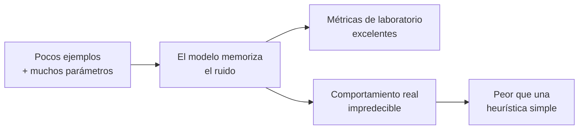
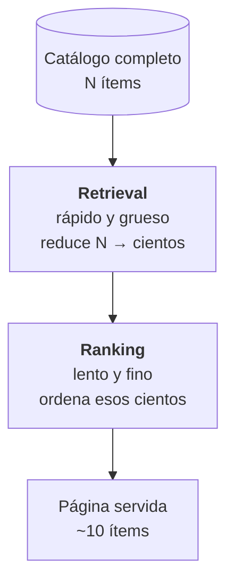
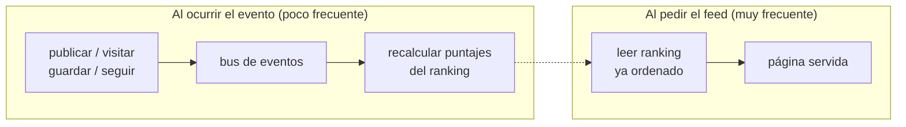
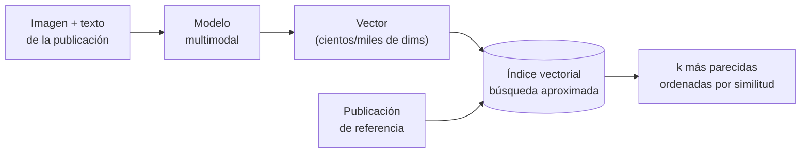
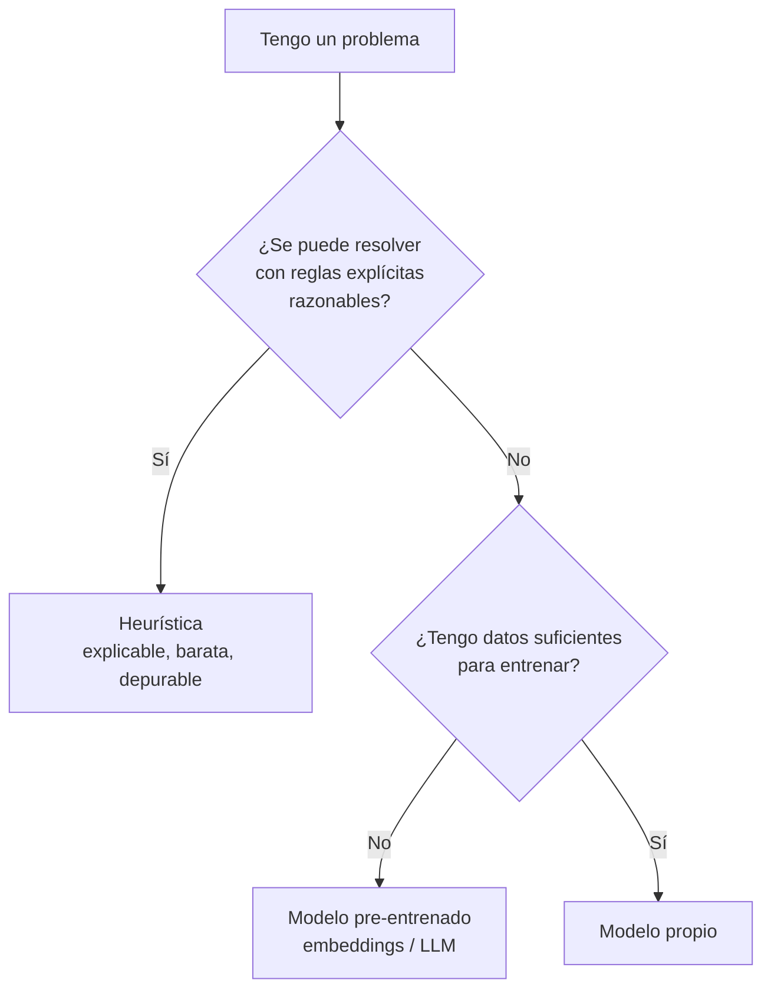
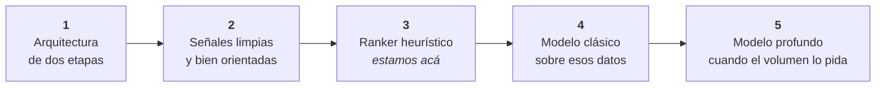

Cuando te toca construir el feed de una red social, la tentación es enorme y obvia: hacer *el algoritmo*. Una red neuronal que aprende de cada usuario y le sirve exactamente lo que quiere ver.

Era, además, la opción divertida. Y la que mejor queda contada en cualquier presentación.

Soy co-fundador y CTO de Branded, una startup en etapa temprana: una red social donde creadores de contenido, marcas y compradores se cruzan. El feed es, literalmente, el producto. Si el feed es malo, no hay nada.

Así que hice lo que hago siempre antes de construir algo grande: me senté a estudiarlo en serio. Leí el paper de Covington y compañía sobre las redes neuronales profundas detrás de las recomendaciones de YouTube, entendí la arquitectura, y me puse a escribir un documento para bajarlo a nuestra realidad.

Ese documento tiene una sección que titulé **"La realidad, sin maquillaje"**. Ahí se me terminó la fantasía.

## La física de los datos

El sistema del paper se entrena con cientos de miles de millones de ejemplos, un vocabulario de millones de videos y miles de millones de usuarios.

Yo medí lo que teníamos nosotros: interacciones diarias que se cuentan en decenas. Decenas. No millones.

La brecha era de ocho o nueve órdenes de magnitud.

Y acá está lo que quiero que quede, porque me llevó un rato entenderlo del todo:

> **No era una brecha de ingeniería. Era una brecha de física de datos.**

Una brecha de ingeniería se cierra con trabajo: más horas, mejor código, más infraestructura. Una brecha de datos no se cierra con esfuerzo. Simplemente no hay de dónde aprender.

### Por qué, en criollo, no aprende

Un modelo aprende ajustando parámetros. Muy a grandes rasgos, para que generalice en vez de memorizar, necesitás que la cantidad de ejemplos supere holgadamente a la cantidad de parámetros:

$$
N_{\text{ejemplos}} \;\gg\; N_{\text{parámetros}}
$$

Una red de recomendación modesta arranca en cientos de miles de parámetros solo en la capa de representaciones (una por ítem del catálogo, más otra por cada característica del usuario). Del otro lado, mi conjunto de entrenamiento eran unos pocos miles de interacciones al mes.

Cuando esa desigualdad se da vuelta, pasa esto:

El modelo no aprende la señal: **memoriza el ruido**. Y como el ruido no se repite, en producción se comporta de forma errática. El error de entrenamiento baja, el error real sube. Sobreajuste de manual.

Peor todavía: sería más caro, más lento de iterar y —lo más grave— **casi imposible de depurar** cuando el feed empiece a mostrar cosas raras. Porque va a mostrar cosas raras.

El propio paper lo dice, y es lo que más me marcó: el árbitro es el experimento en vivo con usuarios reales, y las métricas de laboratorio no correlacionan bien con eso.

Podía construirlo. Tenía las herramientas, el conocimiento y muchas ganas. Habría quedado espectacular contarlo.

Y habría sido la peor decisión técnica del proyecto.

## Qué construí en lugar de eso

Descartar la red neuronal no fue tirar el paper a la basura. Fue separar dos cosas que casi siempre vienen mezcladas: **la arquitectura y el modelo**.

Esa separación es la idea más valiosa que me llevé, y es independiente de si usás machine learning o no.

### Decisión 1: dos etapas

Todo sistema de recomendación serio tiene la misma forma: primero recuperar candidatos, después ordenarlos.

¿Por qué dos etapas y no una? Por costo computacional. Si *N* es el catálogo y *k* los candidatos que pasan a la segunda fase:

$$
\begin{aligned}
C_{\text{1 etapa}} &= N \cdot c_{\text{fino}} \\[4pt]
C_{\text{2 etapas}} &= N \cdot c_{\text{barato}} \;+\; k \cdot c_{\text{fino}}
\end{aligned}
$$

Como $k \ll N$ y el scoring barato es órdenes de magnitud más liviano, la segunda opción gana por muchísimo. Y —esto es lo importante— **la forma no depende del modelo**. Podés montar hoy las dos etapas con heurísticas y mañana reemplazar solo el ranker por un modelo entrenado, sin re-arquitecturar nada.

### Decisión 2: mover el trabajo al momento de la escritura

El primer feed que tuvimos calculaba todo al momento de pedirlo: una consulta enorme, con joins y ordenamientos, ejecutada en cada scroll de cada usuario.

Funcionaba, hasta que dejó de funcionar. Y el motivo se ve en una cuenta simple. Si *L* son las lecturas (alguien abre el feed) y *E* las escrituras (alguien publica o interactúa):

$$
\begin{aligned}
\text{calcular al leer:} \quad & C = L \cdot c_{\text{consulta compleja}} \\[4pt]
\text{calcular al escribir:} \quad & C = E \cdot c_{\text{actualización}} \;+\; L \cdot c_{\text{lectura barata}}
\end{aligned}
$$

En una red social **$L$ es muchísimo mayor que $E$**: la gente consume mucho más de lo que produce. Poner el trabajo pesado del lado de *L* es empujar el costo hacia donde más se repite.

Así que lo dimos vuelta:

Servir una página pasó de "resolver una consulta compleja" a "leer una lista ya ordenada". El trabajo se hace una vez cuando pasa algo, no cada vez que alguien mira.

### Decisión 3: un ranking explícito

Con la arquitectura resuelta, el ranking quedó siendo un sistema de puntajes que puedo escribir en una línea:

$$
\text{Score} \;=\; B(a) \;\times\; M_{\text{afinidad}} \;\times\; M_{\text{recencia}} \;\times\; D(t) \;\times\; (1 \pm \varepsilon)
$$

Cada término resuelve un problema distinto:

**$B(a)$, la base de la acción** — no toda interacción demuestra el mismo interés. Guardar algo en una colección dice muchísimo más que pasar por al lado. Seguir a alguien dice todavía más, porque es una apuesta sobre todo su contenido futuro. Los valores se ordenan según cuánta intención requiere cada acción:

$$
B(\text{seguir}) > B(\text{guardar}) > B(\text{publicar}) > B(\text{visitar})
$$

**$M_{\text{afinidad}}$** — amplifica el contenido de creadores con los que ya tenés relación. Si seguís a alguien, nos dijiste explícitamente que te importa.

**$M_{\text{recencia}}$** — un empujón extra si interactuaste con ese creador hace poco. Captura el interés "caliente" del momento, distinto del interés estable.

**$D(t)$, el decaimiento** — el término que mantiene el feed fresco. Sin él, un contenido que explotó hace un mes se queda arriba para siempre. Con decaimiento exponencial:

$$
D(t) = e^{-\lambda t}
$$

donde $t$ es la antigüedad y $\lambda$ regula la velocidad de olvido. Es cómodo pensarlo en términos de **vida media** —el tiempo que tarda un contenido en valer la mitad—:

$$
t_{1/2} = \frac{\ln 2}{\lambda}
$$

Así el parámetro deja de ser abstracto: en vez de discutir "cuánto vale lambda", discutís "queremos que una publicación pierda la mitad de su relevancia en dos días". Eso lo puede opinar cualquiera del equipo, no solo el que escribió el código.

**$(1 \pm \varepsilon)$** — una pizca de aleatoriedad, con $\varepsilon$ chico. Sin esto el feed es determinista y se vuelve monótono: siempre lo mismo, en el mismo orden. Ese ruido controlado es lo que permite que aparezca contenido inesperado.

Acá aparece un problema clásico de estos sistemas, el de **explotación contra exploración**: si solo mostrás lo que ya sabés que funciona, nunca descubrís nada nuevo, y el contenido de creadores sin historial jamás arranca (el famoso *arranque en frío*). La solución es reservar una porción fija de cada página para descubrimiento:

$$
\text{página} = (1 - p) \cdot [\text{mejor contenido conocido}] \;+\; p \cdot [\text{exploración}]
$$

Con $p$ chico y fijo. Simple, predecible, y suficiente.

### La ventaja que nadie menciona: se puede explicar

Hay algo que no es técnico y terminó siendo lo más valioso: **un sistema de puntajes explícito lo puedo explicar**.

Cuando el CEO me pregunta por qué una publicación no está apareciendo, hay una respuesta concreta: se publicó hace seis días, el autor no tiene afinidad con ese usuario, y el decaimiento la dejó por debajo del umbral. Y entonces podemos discutir lo que realmente importa: **si el criterio es el correcto**.

Con una red neuronal, la respuesta habría sido "el modelo decidió". En una etapa donde todavía estamos aprendiendo qué hace bueno a un feed, poder discutir el criterio vale más que cualquier ganancia de precisión.

¿Es "el algoritmo de YouTube"? No. **Es la arquitectura de YouTube con el motor que corresponde a nuestro tamaño.** Y el día que el volumen lo justifique, se cambia el motor sin tocar el chasis.

## Dónde la IA sí se gana su lugar

Nada de esto es estar en contra de la IA. Al contrario: tenemos IA de verdad en producción, y ahí hace un trabajo que ninguna heurística podría hacer.

### Embeddings multimodales

De cada publicación generamos representaciones vectoriales de la imagen y del texto. Un embedding convierte contenido en un punto dentro de un espacio de muchas dimensiones, donde **la cercanía significa parecido semántico**.

Con eso, "buscar contenido parecido" se vuelve un problema geométrico. La medida habitual es la similitud coseno:

$$
\operatorname{sim}(\mathbf{a}, \mathbf{b}) = \frac{\mathbf{a} \cdot \mathbf{b}}{\lVert \mathbf{a} \rVert \, \lVert \mathbf{b} \rVert}
$$

Que da 1 si los vectores apuntan al mismo lado, 0 si no tienen relación. Ordenás por esa similitud y tenés "publicaciones similares".

El problema práctico: comparar contra todo el catálogo es $O(N)$ por consulta, y cada comparación es sobre vectores de miles de dimensiones. Eso no escala. La solución son los **índices de vecinos aproximados**, que sacrifican un poco de exactitud a cambio de un salto brutal de velocidad:

| | Complejidad | Recall |
|---|---|---|
| Búsqueda exacta | $O(N)$ | 100 % |
| Búsqueda aproximada | $\sim O(\log N)$ | ~95-99 % |

Ese 1-5% de recall que se pierde es invisible para el usuario —nadie nota que la novena sugerencia no era exactamente la novena mejor— y a cambio la consulta pasa de segundos a milisegundos. Es un trade-off tan bueno que casi parece trampa.

### Modelos de lenguaje para enriquecer contenido

También usamos modelos generativos para producir automáticamente, por cada publicación, el contenido orientado a buscadores, las etiquetas descriptivas y los colores dominantes.

Antes eso se cargaba a mano, publicación por publicación — o directamente no existía. Y no era un problema de pereza: **describir qué hay en una foto no tiene solución determinística**. No hay una función que mire píxeles y devuelva "saco de lino beige oversize".

Eso habilitó filtros de búsqueda por color y por términos reales que la gente usa, algo imposible antes porque esa información simplemente no estaba en ninguna parte.

### El patrón

Mirá los tres casos juntos:

| Problema | ¿Solución determinística? | Herramienta correcta |
|---|---|---|
| Ordenar una lista con pocas señales | Sí, una fórmula | Heurística |
| Entender qué hay en una imagen | No | IA |
| Escribir texto descriptivo natural | No | IA |
| Encontrar contenido parecido | No trivialmente | IA (embeddings) |

El patrón es nítido: **la IA se gana su lugar cuando el problema no tiene una solución determinística razonable.** Para ordenar una lista con pocas señales por día, no aportaba nada. Aportaba riesgo.

> **La pregunta no es "¿puedo usar IA acá?". Es "¿qué problema tengo, y la IA es la mejor herramienta para ese problema?".**

Casi nadie hace la segunda pregunta. Es la más importante de las dos.

## El camino que sí dejamos abierto

Descartar la red neuronal hoy no significa cerrarle la puerta. Significa construir en el orden correcto:

Los pasos 1 y 2 son los que de verdad importan y son los que casi todos se saltean. La arquitectura permite cambiar el motor sin rehacer nada. Las señales limpias son el combustible: **cualquier modelo futuro solo puede aprender de datos que hoy estés guardando bien.**

Hay un detalle en el paso 2 que vale oro y que también sale del paper: **elegir bien qué predecís**. YouTube no optimiza clicks, optimiza tiempo de visualización. ¿Por qué? Porque optimizar clicks premia el contenido engañoso: la miniatura que promete algo que el contenido no cumple gana, aunque el usuario se arrepienta al instante.

| Qué optimizás | Qué termina premiando |
|---|---|
| Clicks | El título y la miniatura llamativos |
| Tiempo real de consumo | El contenido que efectivamente vale |

Si entrenás sobre la métrica equivocada, el modelo va a aprender exactamente lo que le pediste — y lo que le pediste era el problema.

## Lo que aprendí

Que la parte difícil de la IA casi nunca es implementarla. Hoy, con las herramientas que hay, montar embeddings o conectar un modelo es cuestión de días.

La parte difícil es **decidir si corresponde**. Y esa decisión no sale de leer papers ni de mirar qué está usando el resto: sale de medir tu propia realidad y aceptar lo que dice el número, aunque el número te arruine el plan divertido.

Si sos founder y estás por pedir "el algoritmo de TikTok" para tu producto: el problema no es el presupuesto ni el talento del equipo. Es que sin datos no hay nada que aprender. Lo que sí se puede hacer desde el día uno —y es lo que de verdad te va a servir— es dejar la arquitectura preparada y las señales limpias para cuando esos datos existan.

La decisión técnica de la que más orgulloso estoy en estos tres años no fue construir algo.

Fue medir con honestidad, entender que la herramienta de moda era la incorrecta para el problema que tenía, y **no construirla**.
