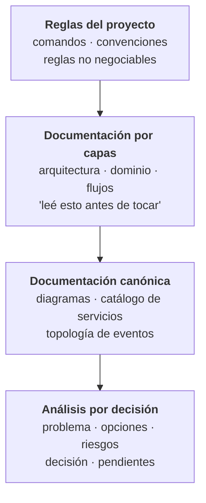
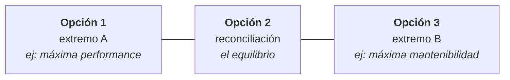
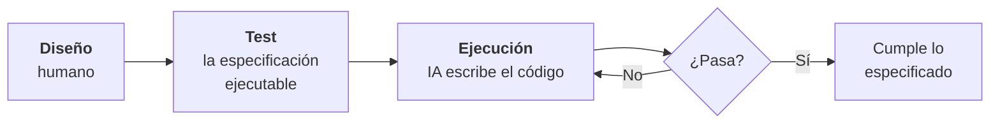
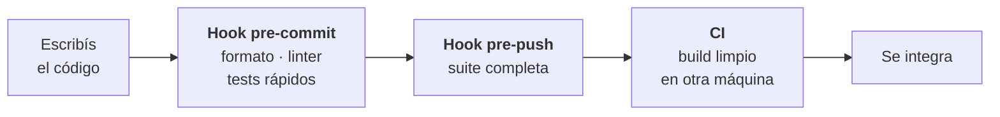
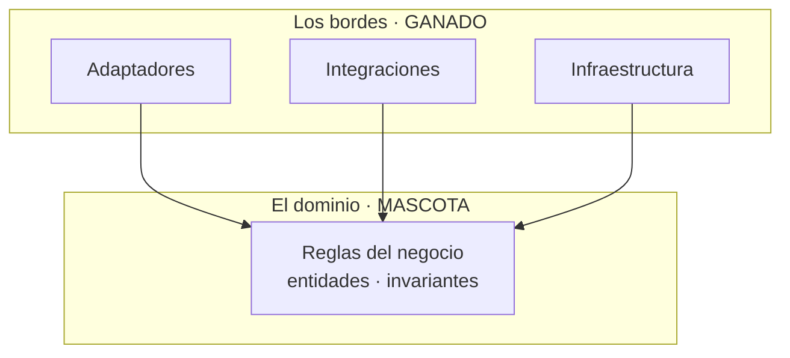
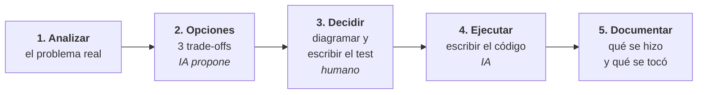

Necesitábamos métricas. Le pedí a la IA que las resolviera.

Y las resolvió. Con las herramientas que ya había en el proyecto, se armó un motor de recolección propio: eventos, agregaciones, todo. Funcionaba, más o menos.

El problema apareció después. Los datos salían inconsistentes. Y cuando quise agregar una métrica nueva, me encontré con algo peor que un bug: **una pieza imposible de mantener**. Cada cambio rompía otra cosa. Las decisiones de diseño que había tomado eran malas — no equivocadas de forma obvia, sino malas de esa forma que solo se nota meses después, cuando ya no podés tocar nada sin miedo.

Terminé tirándolo. Migramos a una herramienta ya hecha y ganamos tiempo y precisión.

Pero me quedé pensando en qué había fallado exactamente. Porque el código compilaba, hacía lo que le pedí, y estaba razonablemente escrito.

Lo que falló fue anterior: **yo la había dejado decidir**.

## La regla

Ese no fue el único episodio. Hubo varios flujos rotos en esa época, y si puedo contarlo con humor es únicamente porque existe Git. La red de seguridad hizo su trabajo mientras yo aprendía la lección.

Después de esos golpes cambié el enfoque por completo. Y lo puedo resumir en una línea:

> **No la dejo pensar ni decidir. Solo accionar.**

Cada cosa que hace tiene que estar explicada por mí, o elegida por mí entre opciones que me ofrece. Todo el código que la IA escribió en nuestros sistemas lo diseñé yo, lo diagramé yo, y ella ejecutó mi plan.

El efecto no fue solo de calidad. **Las alucinaciones bajaron muchísimo.**

Y tiene una explicación bastante simple: un modelo alucina cuando tiene que llenar huecos. Cuando le decís "resolvé las métricas", el hueco es enorme y lo va a llenar con lo que le parezca plausible. Cuando le decís "creá este adaptador, que implementa este puerto, recibe estos datos, los transforma así y respeta esta regla de dependencia", no queda hueco que rellenar. Deja de imaginar y empieza a construir.

La diferencia entre las dos instrucciones no es de longitud. Es de **quién tomó las decisiones**.

## Por qué la IA toma malas decisiones de diseño

Acá va la parte que creo que casi nadie dice, y que a mí me ordenó la cabeza.

Toda la historia de la tecnología es la historia de gente que quería trabajar menos. Abstraemos porque repetir nos aburre. Creamos funciones para no escribir lo mismo dos veces. Inventamos frameworks para no resolver el mismo problema en cada proyecto. Aparecieron los lenguajes de alto nivel porque nadie quería seguir escribiendo ensamblador. **La pereza es el motor de la abstracción.**

La IA no es vaga. No se cansa, no se aburre, no le duele escribir mil veces el mismo bloque.

Y entonces no tiene ninguna presión interna hacia la abstracción. Reproduce. Si le pedís veinte veces algo parecido, te lo escribe veinte veces, contenta, sin que se le cruce por ningún lado la idea de que eso podría ser una sola pieza reutilizable.

> **La mantenibilidad no le importa, porque no es ella la que va a mantenerlo.**

Vos sí. Vos vas a volver a ese archivo dentro de ocho meses, con otra cabeza y sin recordar nada. El criterio de diseño solo lo puede tener el humano que va a convivir con ese código. Esa asimetría —quién paga el costo futuro— es la razón de fondo por la que las decisiones no se delegan.

Un modelo optimiza para que el código funcione ahora. Un buen ingeniero optimiza para que el sistema se pueda cambiar después. No es la misma función objetivo.

## La IA multiplica, no reemplaza

La forma más corta que encontré de explicarlo:

$$
\text{Resultado} = \text{Criterio propio} \times \text{Velocidad de la IA}
$$

La IA no hace las cosas por vos: **multiplica lo que ya sos**. Si tenés criterio, lo amplifica de una forma que hace cinco años era impensable.

Y si tu criterio es cero:

$$
0 \times \text{cualquier cosa} = 0
$$

Podés producir una cantidad enorme de código y no haber construido nada que sirva. Es más: vas a haber construido, mucho más rápido, el problema que vas a tener el año que viene.

Esto no es una metáfora bonita. Es literalmente lo que me pasó con el motor de métricas: obtuve muchísimo código funcional, rápido, y el resultado neto fue negativo. Trabajo para producirlo, trabajo para mantenerlo, trabajo para tirarlo.

## Qué significa "darle contexto" (spoiler: no es un prompt largo)

Lo que hago no es escribir buenos prompts. Es construirle un **entorno de contexto**.

Y no lo diseñé de entrada. Fue escalando junto con los modelos.

**Etapa 1 — el kit mínimo.** Al principio eran unos pocos documentos por proyecto: dónde está cada cosa, qué patrón sigue, qué no hay que romper. Alcanzaba para que Mati y yo mantuviéramos el hilo cuando cada uno abría un servicio distinto.

**Etapa 2 — el contexto global.** Cuando las ventanas de contexto crecieron, armé algo más ambicioso: una carpeta que reúne el contexto de **todos** nuestros proyectos, con un asistente configurado para consumirla. Eso cambió la escala del juego: pasó de "esta IA entiende este archivo" a "esta IA entiende el sistema".

**Etapa 3 — documentar los flujos.** Con eso montado, empecé a hacer análisis de flujos completos: agarrar un recorrido de punta a punta —publicar contenido, iniciar sesión, sincronizar un catálogo— y documentarlo entero. Generábamos el documento, yo lo evaluaba, **verificaba contra el código que fuera correcto**, corregía, y seguía con el flujo siguiente.

Esa verificación no es un detalle: es lo que separa una documentación útil de una novela de ciencia ficción. Un documento generado y no verificado es peor que no tener nada, porque después le vas a creer.

**Etapa 4 — mejorar.** Cuando tuve los flujos principales documentados y verificados, empecé a mejorarlos de a uno.

Hoy el sistema tiene cuatro capas:

La capa 1 es la más importante y la más barata: un archivo por repo con las reglas del proyecto. No es documentación general — son **barandas**, y cada una codifica un dolor real que ya pagamos.

Una de las nuestras, por ejemplo, prohíbe meter valores que cambian rápido en un contexto global, porque el re-renderizado en cascada fue *el* problema de performance de esa base de código. Eso no está para explicar cómo funciona React. Está para que nadie —ni la IA, ni yo dentro de seis meses— vuelva a pisar esa mina.

Cada regla de esas es una cicatriz convertida en instrucción.

## La regla de las tres opciones

Tengo configurado que nunca me traiga una solución. Siempre tres.

Y no son tres variantes cualesquiera: **cada opción tiene que maximizar un atributo de calidad y sacrificar otro**. Performance contra fiabilidad. Mantenibilidad contra compatibilidad. Velocidad de entrega contra flexibilidad futura.

La forma que toman suele ser esta:

La primera y la última son los extremos; la del medio es la reconciliación de las dos. Casi todo en arquitectura tiene esa estructura: dos fuerzas opuestas y un punto de encuentro.

¿Para qué sirve? Para **obligarme a comparar trade-offs en vez de aceptar lo primero que aparece**.

Con una sola opción, el sesgo es evaluar si esa opción es buena — y casi siempre lo parece, porque viene bien argumentada. Con tres, la pregunta cambia por completo: qué me da y qué me quita cada una. Que es la única pregunta que importa en arquitectura.

Siempre tengo que estar consciente de lo que gano y lo que pierdo. Un diseño no es "bueno": es bueno **para** ciertas cosas y malo para otras. Las tres opciones me fuerzan a hacer explícito ese *para*.

En la práctica, muchas veces terminé eligiendo una mezcla de dos, o tomando una y reformulándola. Casi nunca acepto una tal cual viene.

Y ese es exactamente el punto: **las opciones no son para elegir. Son para pensar.**

## También está configurada para contradecirme

Esta es la parte que más me sorprendió que funcionara: en el contexto general del proyecto dejé escrito que **debe contradecirme cuando no tengo razón y buscar activamente mis sesgos**.

Suena raro configurar una herramienta para que te discuta. Pero funcionó.

El caso más grande: cuando me quise mandar a construir un algoritmo de recomendación estilo YouTube para nuestro feed. Yo tenía las ganas, el paper leído y el plan armado. Estaba convencido.

Al confrontar la idea contra nuestro volumen real de datos, quedó a la vista que era una mala decisión — no por ingeniería, sino porque no había datos suficientes de los que aprender. Terminé escribiendo un documento entero sobre por qué **no** construirlo.

Ese es, probablemente, el mejor retorno que me dio esta forma de trabajar: no el código que escribió, sino el código que me convenció de no escribir.

Un asistente configurado para complacerte te deja hacer cualquier cosa, y encima te felicita. Uno configurado para discutir te ahorra meses.

## Los tests dejaron de ser opcionales (y cambiaron de función)

Si hay una práctica que pasó de "buena idea" a "condición necesaria" cuando empecé a delegar la ejecución, es TDD.

El razonamiento es directo. Si yo diseño y otro ejecuta, necesito una forma **automática y objetiva** de responder una sola pregunta: ¿lo que se construyó hace lo que yo especifiqué?

Sin tests, esa verificación la tengo que hacer leyendo. Y leer código generado, línea por línea, buscando desviaciones sutiles, es más lento que escribirlo. Se pierde toda la ventaja.

Con tests escritos **antes**, el proceso se da vuelta:

El test deja de ser una red de seguridad y pasa a ser otra cosa: **el contrato**. Es la traducción ejecutable de mi decisión de diseño. La IA no tiene que adivinar qué quise decir — tiene un criterio binario de éxito, y puede iterar contra él sin que yo intervenga.

Pero hay algo todavía más importante, y es lo que más defiendo de esta práctica:

> **La suite de pruebas es donde el negocio queda explicado.**

Un test bien escrito no dice "el método devuelve 200". Dice qué tiene que pasar cuando un creador publica sin haber completado su perfil, qué pasa cuando llega una actualización de un producto que ya no existe, qué pasa cuando dos acciones compiten por el mismo recurso. Eso **son las reglas del negocio**, escritas de una forma que no se puede desactualizar — porque si el código deja de cumplirlas, la suite se pone en rojo.

Volviendo a la distinción de antes: el dominio es lo que hay que proteger, y **los tests del dominio son esa protección**. Podés regenerar un adaptador entero con IA sin miedo, porque si en el camino rompiste una regla del negocio, los tests te lo gritan.

Es la diferencia entre documentación que envejece y documentación que se ejecuta. Un comentario puede mentir durante años. Un test, no.

### Y los tests tienen que ser imposibles de saltear

Un detalle que parece de plomero y es de arquitectura: **una regla que depende de que alguien se acuerde no es una regla, es un deseo.**

Cuando estás cansado, cuando el cambio es "chiquito", cuando ya probaste a mano y andaba — ahí es cuando se saltea la suite. Y ahí es exactamente cuando entra lo roto.

Por eso los seguros van automatizados, en capas:

Un **hook de Git que corre las pruebas antes de pushear** es de las cosas más baratas de configurar y de las que más rinden: si la suite se pone en rojo, el push no sale. Punto. No hay que discutirlo con nadie ni acordarse de nada.

La lógica de las capas es simple: en el *pre-commit* van las verificaciones rápidas (formato, linter, tests unitarios) porque tienen que doler poco; en el *pre-push* va la suite completa, que puede tardar más porque se ejecuta muchas menos veces. Y arriba de todo la integración continua, que es la única que corre en una máquina limpia — la que te salva del clásico "en mi compu andaba".

Esto vale el doble cuando delegás la ejecución. El volumen de código que produce la IA es mucho mayor que el que producirías a mano, y revisar cada línea con la misma lupa es imposible. Necesitás que **el sistema rechace solo lo que no cumple**, sin depender de tu atención.

Es la misma idea de las barandas en el archivo de reglas, pero ejecutable: convertir criterio en algo que se aplica aunque nadie esté mirando.

## Auditar 125 mil líneas

Hay un uso donde la IA rinde de una forma que ningún humano puede igualar, y no es escribir: es **leer**.

Hicimos una auditoría técnica completa de nuestro monorepo: veinte proyectos, unas 125 mil líneas entre servicios backend, frontends, la app móvil y la configuración. Seguridad, consistencia arquitectónica, performance, testing, y un plan de remediación por fases.

Ningún equipo de dos personas se sienta a leer 125 mil líneas buscando inconsistencias. No es cuestión de ganas: es tiempo que no existe.

Y encontró cosas. Muchos errores que yo no había visto, algunos con años de antigüedad, escondidos justamente en las partes que uno deja de mirar porque "eso ya funciona". Tiene una capacidad muy buena para el detalle: para notar que este servicio maneja los errores distinto que los otros seis, o que ese parámetro quedó configurado con un valor que no tiene sentido.

La clave está en qué se hace con esa salida. Un informe de auditoría no es una lista de tareas: es una lista de **candidatos**. Priorizar por severidad, decidir qué se toca y qué no, y armar el plan por fases — eso sigue siendo trabajo humano. La IA encuentra; vos decidís qué importa.

Es la misma división de siempre, aplicada a otro terreno: ella recorre, yo juzgo.

## Código como ganado

Acá hay algo que suena contradictorio y quiero desarmar.

Por un lado soy insoportablemente estricto con la arquitectura: DDD, hexagonal, la regla de dependencia no se negocia. Por el otro, tengo que admitir que **hoy le voy faltando el respeto al código**.

Con la IA puedo construir una solución robusta, mirarla funcionando, y descartarla entera porque encontré un enfoque mejor. Eso antes era impensable. Producir código costaba tanto que uno terminaba defendiendo lo que había escrito solo por lo que le había costado escribirlo. **El costo hundido decidía la arquitectura.**

¿Cuántas veces viste a un equipo sostener un diseño malo porque tirarlo significaba admitir tres meses perdidos? Yo unas cuantas. Y lo entiendo perfectamente: conozco ese dolor, lo sufrimos durante años.

Pero ese cálculo cambió. Si una solución robusta cuesta unas horas en lugar de semanas, **experimentar deja de ser un lujo y descartar deja de ser un drama**. Podés probar el enfoque A, verlo andar, entender por qué no sirve, y tirarlo sin que te tiemble la mano.

Creo que ya es hora de dejar de romantizar el código: **es ganado, no una mascota.**

Ahora bien, la distinción importa muchísimo, y es exactamente la que da la arquitectura hexagonal:

**El dominio es lo único inmutable.** Es el core del negocio: las reglas que hacen que el sistema haga lo que el negocio necesita que haga. Eso se protege, se piensa despacio, se cambia con cuidado y no se delega jamás. Es la parte que no se puede regenerar, porque no está escrita en ningún otro lado — es el conocimiento del negocio convertido en código.

**La forma en que el negocio se acciona —los bordes— es ganado.** Los adaptadores, las integraciones, la infraestructura: reemplazables, desechables, regenerables. Si mañana hay una forma mejor de hablar con un proveedor externo, se tira y se hace de nuevo. No pasa nada. Justamente para eso separamos las capas.

Y fijate que hay una consecuencia práctica hermosa en esto: **la arquitectura hexagonal, que ya era buena idea, se volvió todavía mejor idea.** Si tus bordes están bien aislados detrás de puertos, podés regenerarlos con IA sin tocar el corazón del sistema. La misma disciplina que te protegía de un cambio de proveedor ahora te protege de tu propia velocidad.

Ya vivimos este cambio antes, además. Pasó con los servidores cuando aparecieron los contenedores: dejaron de ser máquinas con nombre propio, cuidadas a mano, y pasaron a ser instancias desechables que se levantan y se destruyen sin ceremonia. El mercado va hacia componentes digitales desechables, y el código está entrando en esa categoría.

Muchos desarrolladores no van a estar de acuerdo conmigo. Lo entiendo, y respeto el argumento. Pero mi trabajo no es proteger el código: **es proteger el dominio.**

## Cómo evito que la documentación se pudra

La objeción obvia a todo esto: documentación desactualizada es peor que ninguna.

Es cierto. Y la resolví no prometiendo lo imposible. En nuestra documentación hay una regla escrita:

> Si encontrás una discrepancia entre lo documentado y el código, **gana el código** — y corregí el documento.

No prometo que los documentos estén siempre al día. **Declaro qué manda cuando no lo están.**

Parece un detalle menor y es lo que sostiene todo el sistema. Con esa regla, un documento desactualizado deja de ser una trampa y pasa a ser una pista: te orienta, y si algo no coincide, ya sabés a quién creerle y qué corregir. Sin esa regla, cada discrepancia es una discusión.

La segunda regla es igual de importante: se documenta **el porqué**, no el qué.

El qué se lee en el código. Lo que se pierde —y sale carísimo recuperar— es la razón: qué trade-off se eligió, qué restricción operativa había, qué incidente pasado motivó esa decisión rara que hoy parece arbitraria. Cuando una decisión tiene una motivación específica, esa motivación va escrita al lado.

Y sí, respondiendo a lo que me preguntan siempre: **antes de la IA no escribía ni la mitad de esto**.

La herramienta que supuestamente vuelve vago a cualquiera me volvió mucho más riguroso. Porque para que ejecute bien, tengo que pensar bien primero. El plan dejó de ser opcional: es el insumo del proceso.

## El flujo completo

Poniéndolo todo junto, así se ve una funcionalidad de punta a punta:

Los pasos 1 a 3 son míos. El 4 es de ella. El 5 lo hacemos juntos.

Cuando llego al paso 4, **ya tengo el código en la cabeza**: sé cómo se va a ver, qué capas toca, qué puertos y adaptadores aparecen, dónde va cada responsabilidad. La IA no está resolviendo un problema abierto: está tipeando una solución que ya existe. Por eso sale bien.

Si alguna vez sentiste que la IA te devuelve cualquier cosa, probablemente el problema no fue el prompt. Fue que le pediste que resolviera algo que vos todavía no habías resuelto.

### Por qué los diagramas van en texto

Un detalle práctico que cambió más de lo que esperaba: hago todos los diagramas en Mermaid, es decir, en texto.

Dos razones. La primera es que **los modelos producen texto mucho mejor que imágenes**: un diagrama descrito en texto sale bien y sale rápido, mientras que pedir una imagen es una lotería.

La segunda es más importante: un diagrama en texto **se versiona**. Vive en el repositorio, se revisa en un pull request como cualquier otro cambio, se le puede ver el historial y se corrige en dos líneas. Un diagrama que es una imagen se desactualiza el mismo día que alguien toca el código, y nadie lo va a rehacer.

La documentación que no se puede versionar no se mantiene. Es así de simple.

## Si querés empezar mañana

El error más común es arrancar por la herramienta: bajarse el asistente de moda y empezar a pedirle cosas. El orden correcto empieza mucho antes.

**1. Entendé el negocio, en serio.** Qué métricas quiere mover la empresa, qué se quiere lograr, hacia dónde apunta. Es un enfoque de resultados: sin conocimiento profundo del negocio no se pueden tomar buenas decisiones técnicas — con IA o sin IA. Toda decisión de arquitectura es, en el fondo, una apuesta sobre qué va a necesitar el negocio después.

**2. Escribí vos las reglas.** Primero de tu puño, después conversalas con un asistente para pulirlas y ordenarlas. Ese es tu primer archivo de contexto. No lo delegues: las reglas salen de tu criterio, no de un modelo.

**3. Escribí el test antes.** Es tu especificación ejecutable y el único control automático de que lo construido hace lo que pediste. Sin tests, delegar la ejecución es apostar — y encima te obliga a revisar leyendo, que es más lento que escribir.

**4. Automatizá el seguro.** Un hook de Git que corra la suite antes de pushear. Es media hora de configuración y convierte tu disciplina en algo que no depende de tu memoria ni de tu cansancio.

**5. Comentá los trade-offs.** No lo que hace el código: por qué está así, y qué se descartó.

**6. Que cada cambio devuelva un documento.** Qué se hizo y qué partes quedaron involucradas. Es barato en el momento y carísimo de reconstruir seis meses después.

**7. Analizá antes de implementar.** Documento de opciones, decisión tomada, diagrama, y recién ahí ejecutás.

Si te parece mucho, empezá solo por el paso 2. Un archivo con las reglas de tu proyecto ya cambia bastante la calidad de lo que recibís, y te lleva una tarde.

## Lo que les digo a mis alumnos

Doy clases casi todos los días, así que esta pregunta me llega seguido: ¿un junior puede trabajar así?

Mi respuesta es que primero hay que ir a las bases. Los problemas del software y los principios de diseño. Cómo funciona la memoria, los hilos, los procesos. Todo eso que parece viejo y no lo es — porque es justamente lo que te permite darte cuenta de que una solución que "anda" está mal.

Y hay que investigar mucho el mercado: qué se está usando, qué discuten otros ingenieros, qué problemas están resolviendo. El criterio no se descarga: se construye mirando mucho y equivocándose bastante.

Porque volvemos a la multiplicación. La IA amplifica tu criterio — y si no tenés criterio, no hay nada que amplificar. Es muy fácil caer en dejar que la IA haga todo por vos. Incluso pensar.

Y ahí está la trampa: **el día que le delegás el pensamiento, dejaste de ser el multiplicador y pasaste a ser el cero.**
