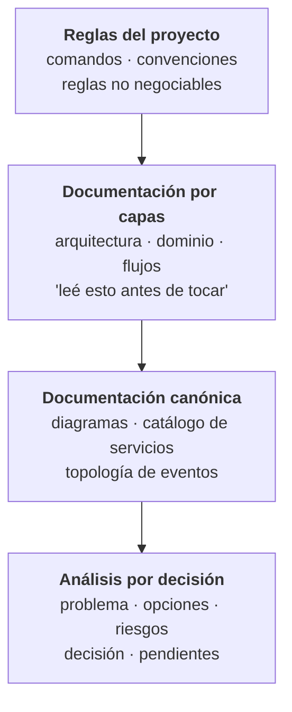
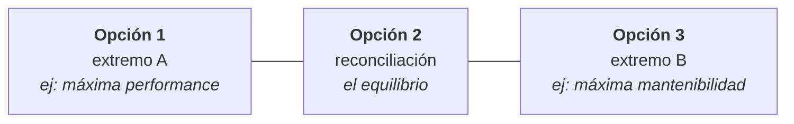
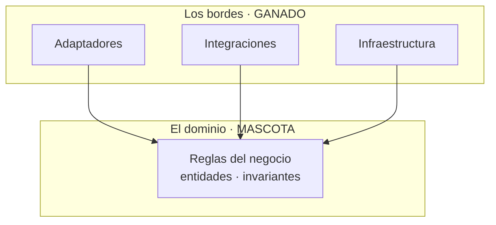
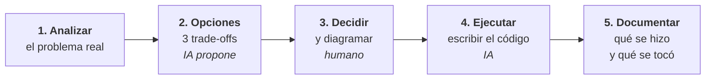

Necesitábamos métricas. Le pedí a la IA que las resolviera.

Y las resolvió. Con las herramientas que ya había en el proyecto, se armó un motor de recolección propio: eventos, agregaciones, todo. Funcionaba, más o menos.

El problema apareció después. Los datos salían inconsistentes. Y cuando quise agregar una métrica nueva, me encontré con algo peor que un bug: **una pieza imposible de mantener**. Cada cambio rompía otra cosa. Las decisiones de diseño que había tomado eran malas — no equivocadas de forma obvia, sino malas de esa forma que solo se nota meses después, cuando ya no podés tocar nada.

Terminé tirándolo. Migramos a una herramienta ya hecha y ganamos tiempo y precisión.

Pero me quedé pensando en qué había fallado exactamente. Porque el código compilaba, hacía lo que le pedí, y estaba razonablemente escrito.

Lo que falló fue anterior: **yo la había dejado decidir**.

## La regla

Después de ese episodio —y de unos cuantos flujos rotos que solo Git me salvó de llorar— cambié el enfoque por completo. Y lo puedo resumir en una línea:

> **No la dejo pensar ni decidir. Solo accionar.**

Cada cosa que hace tiene que estar explicada por mí, o elegida por mí entre opciones que me ofrece. Todo el código que escribió la IA en nuestros sistemas lo diseñé yo, lo diagramé yo, y ella ejecutó mi plan.

El efecto no fue solo de calidad: **las alucinaciones bajaron muchísimo**. Tiene lógica. Un modelo alucina cuando tiene que llenar huecos. Si el plan está completo —qué construir, dónde, con qué restricciones—, no queda hueco que rellenar.

## Por qué la IA toma malas decisiones de diseño

Acá va la parte que creo que casi nadie dice, y que a mí me ordenó la cabeza.

Toda la historia de la tecnología es la historia de gente que quería trabajar menos. Abstraemos porque repetir nos aburre. Creamos funciones para no escribir lo mismo dos veces. Inventamos frameworks para no resolver el mismo problema en cada proyecto. **La pereza es el motor de la abstracción.**

La IA no es vaga. No se cansa, no se aburre, no le duele escribir mil veces el mismo bloque.

Y entonces no tiene ninguna presión interna hacia la abstracción. Reproduce. Si le pedís veinte veces algo parecido, te lo escribe veinte veces, contento.

> **La mantenibilidad no le importa, porque no es ella la que va a mantenerlo.**

Vos sí. El criterio de diseño solo lo puede tener el humano que va a convivir con ese código dentro de dos años. Esa asimetría es la razón de fondo por la que las decisiones no se delegan.

## La IA multiplica, no reemplaza

La forma más corta que encontré de explicarlo:

$$
\text{Resultado} = \text{Criterio propio} \times \text{Velocidad de la IA}
$$

La IA no hace las cosas por vos: **multiplica lo que ya sos**. Si tenés criterio, lo amplifica de una forma que hace cinco años era impensable.

Y si tu criterio es cero:

$$
0 \times \text{cualquier cosa} = 0
$$

Podés producir una cantidad enorme de código y no haber construido nada que sirva. Es más: vas a haber construido más rápido el problema que vas a tener después.

## Qué significa "darle contexto" (spoiler: no es un prompt largo)

Lo que hago no es escribir buenos prompts. Es construirle un **entorno de contexto**. Y no lo diseñé de entrada: fue escalando a medida que los modelos aguantaban más contexto.

Empezó chico: unos pocos documentos por proyecto, un kit mínimo para que la IA supiera dónde estaba parada. Con eso alcanzaba para mantener el hilo entre Mati y yo.

Cuando las ventanas de contexto crecieron, armé algo más ambicioso: **una carpeta que reúne el contexto de todos nuestros proyectos**, con un asistente configurado para consumirla. Ahí hago análisis de flujos completos, generamos documentos, los evalúo, verifico contra el código que sean correctos, y sigo con el flujo siguiente. Cuando tuve los principales documentados, empecé a mejorar cada uno.

Hoy son cuatro capas:

La capa 1 es la más importante y la más barata: un archivo con las reglas del proyecto. No es documentación general — son **barandas**, y cada una codifica un dolor real. Una de las nuestras dice, textual, que no hay que meter valores que cambian rápido en un contexto global, porque el re-renderizado en cascada fue *el* problema de performance de esa base de código. Eso no está para explicar: está para que nadie —ni la IA, ni yo dentro de seis meses— vuelva a pisar esa mina.

## La regla de las tres opciones

Tengo configurado que nunca me traiga una solución. Siempre tres.

Y no son tres variantes cualesquiera: **cada opción tiene que maximizar un atributo de calidad y sacrificar otro**. Performance contra fiabilidad. Mantenibilidad contra compatibilidad. Velocidad de entrega contra flexibilidad futura.

La forma que toman suele ser esta:

La primera y la última son los extremos; la del medio es la reconciliación de las dos.

¿Para qué sirve esto? Para **obligarme a comparar trade-offs en vez de aceptar lo primero que aparece**. Con una sola opción, el sesgo es evaluar si esa opción es buena. Con tres, la pregunta cambia: qué me da y qué me quita cada una. Que es la única pregunta que importa en arquitectura.

Muchas veces terminé eligiendo una mezcla de dos, o tomando una y reformulándola. Casi nunca acepto una tal cual viene. Ese es justamente el punto: las opciones no son para elegir, son para pensar.

## También está configurada para contradecirme

Esta es la parte que más me sorprendió que funcionara: en el contexto general del proyecto dejé escrito que **debe contradecirme cuando no tengo razón y buscar activamente mis sesgos**.

Y me frenó de hacer macanas.

La más grande: cuando me quise mandar a construir un algoritmo de recomendación estilo YouTube para nuestro feed. Yo tenía las ganas, el paper leído y el plan armado. Al confrontar la idea contra nuestro volumen real de datos, quedó a la vista que era una mala decisión — no por ingeniería, sino porque no había datos suficientes de los que aprender. Terminé escribiendo un documento entero sobre por qué **no** construirlo.

Un asistente configurado para complacerte te deja hacer cualquier cosa. Uno configurado para discutir te ahorra meses.

## El dominio es la mascota; los bordes son el ganado

Acá hay algo que suena contradictorio y quiero desarmar.

Por un lado soy insoportablemente estricto con la arquitectura: DDD, hexagonal, la regla de dependencia no se negocia. Por el otro, tengo que admitir que **hoy le voy faltando el respeto al código**.

Con la IA puedo construir una solución robusta, mirarla funcionando, y descartarla entera porque encontré un enfoque mejor. Antes eso era impensable: producir código costaba tanto que uno terminaba defendiendo lo que había escrito solo por lo que le había costado. El costo hundido decidía la arquitectura.

Entiendo bien ese dolor. Lo sufrimos durante años. Pero creo que ya es hora de dejar de romantizar el código: **es ganado, no una mascota.**

Ahora bien, la distinción importa muchísimo, y es exactamente la que da la arquitectura hexagonal:

**El dominio es lo único inmutable.** Es el core del negocio: las reglas que hacen que el sistema haga lo que el negocio necesita. Eso se protege, se piensa despacio, se cambia con cuidado y no se delega jamás.

**La forma en que el negocio se acciona —los bordes— es ganado.** Los adaptadores, las integraciones, la infraestructura: reemplazables, desechables, regenerables. Si mañana hay una forma mejor de hablar con un proveedor externo, se tira y se hace de nuevo. No pasa nada.

Ya vivimos esto antes: pasó con los servidores cuando aparecieron los contenedores. Dejaron de ser máquinas con nombre propio que se cuidaban, y pasaron a ser instancias desechables. El mercado va hacia componentes digitales desechables, y el código está entrando en esa categoría.

Muchos desarrolladores no van a estar de acuerdo conmigo. Lo entiendo. Pero mi trabajo no es proteger el código: es proteger el dominio.

## Cómo evito que la documentación se pudra

La objeción obvia a todo esto: documentación desactualizada es peor que ninguna.

La resolví no prometiendo lo imposible. En nuestra documentación hay una regla escrita:

> Si encontrás una discrepancia entre lo documentado y el código, **gana el código** — y corregí el documento.

No prometo que los documentos estén siempre al día. **Declaro qué manda cuando no lo están.** Con eso, un documento desactualizado deja de ser una trampa y pasa a ser una pista.

La segunda regla: se documenta **el porqué**, no el qué. El qué se lee en el código. Lo que se pierde y sale carísimo recuperar es la razón: qué trade-off se eligió, qué restricción operativa había, qué incidente pasado motivó esa decisión rara.

Y sí, respondiendo a lo que me preguntan siempre: **antes de la IA no escribía ni la mitad de esto**. La herramienta que supuestamente vuelve vago a cualquiera me volvió mucho más riguroso, porque para que ejecute bien tengo que pensar bien primero. El plan dejó de ser opcional.

## El flujo completo

Poniéndolo todo junto, así se ve una funcionalidad de punta a punta:

Los pasos 1 a 3 son míos. El 4 es de ella. El 5 lo hacemos juntos.

Cuando llego al paso 4, **ya tengo el código en la cabeza**: sé cómo se va a ver, qué capas toca, qué puertos y adaptadores aparecen. La IA no está resolviendo un problema abierto, está tipeando una solución que ya existe. Por eso sale bien.

Un detalle práctico: los diagramas los hago en Mermaid, en texto. Los modelos producen texto mucho mejor que imágenes, y un diagrama en texto se versiona, se revisa en un pull request y se corrige en dos líneas.

## Si querés empezar mañana

El error más común es arrancar por la herramienta. El orden correcto empieza mucho antes:

**1. Entendé el negocio, en serio.** Qué métricas quiere mover la empresa, qué se quiere lograr, hacia dónde apunta. Es un enfoque de resultados: sin conocimiento profundo del negocio no se pueden tomar buenas decisiones técnicas — con IA o sin IA.

**2. Escribí vos las reglas.** Primero de tu puño, después conversalas con un asistente para pulirlas. Ese es tu primer archivo de contexto. No lo delegues: las reglas salen de tu criterio, no de un modelo.

**3. Que cada funcionalidad tenga su test.** Es la red que te avisa cuando la ejecución se desvió del plan.

**4. Comentá los trade-offs.** No lo que hace el código: por qué está así.

**5. Que cada cambio devuelva un documento.** Qué se hizo y qué partes quedaron involucradas. Es barato en el momento y carísimo de reconstruir después.

**6. Analizá antes de implementar.** Documento de opciones, decisión tomada, y recién ahí ejecutás.

Se puede empezar por el paso 2 solo: un archivo con las reglas de tu proyecto ya cambia bastante la calidad de lo que recibís.

## Lo que les digo a mis alumnos

Doy clases casi todos los días, así que esta pregunta me llega seguido: ¿un junior puede trabajar así?

Mi respuesta es que primero hay que ir a las bases. Los problemas del software y los principios de diseño. Cómo funciona la memoria, los hilos, los procesos. Investigar el mercado, leer lo que discuten otros ingenieros. Todo eso que parece viejo y no lo es.

Porque volvemos a la multiplicación. La IA amplifica tu criterio — y si no tenés criterio, no hay nada que amplificar. Es muy fácil caer en dejar que la IA haga todo por vos. Incluso pensar.

Y ahí está la trampa: **el día que le delegás el pensamiento, dejaste de ser el multiplicador y pasaste a ser el cero.**
