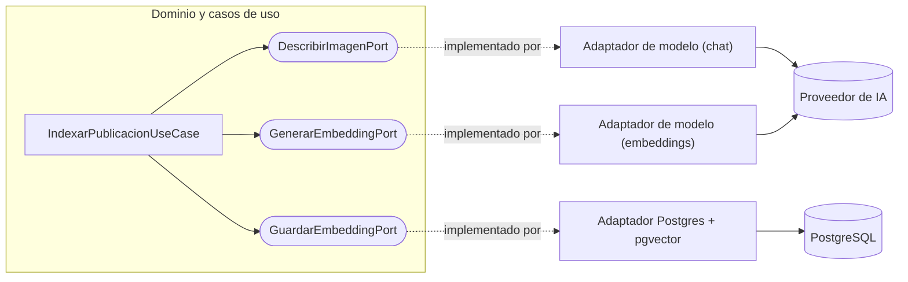
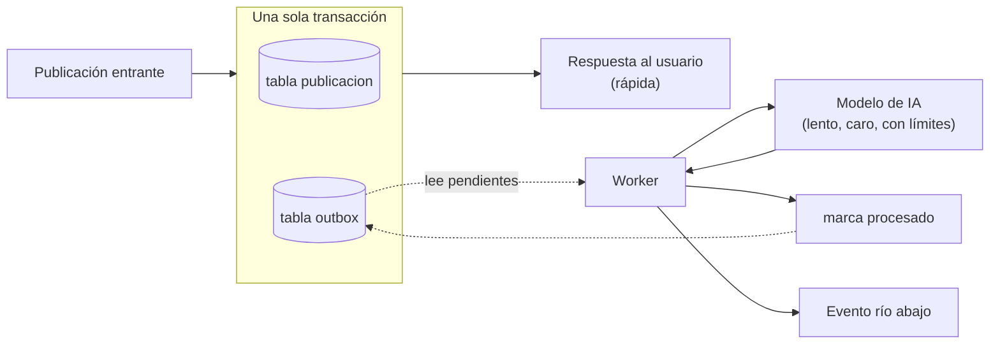
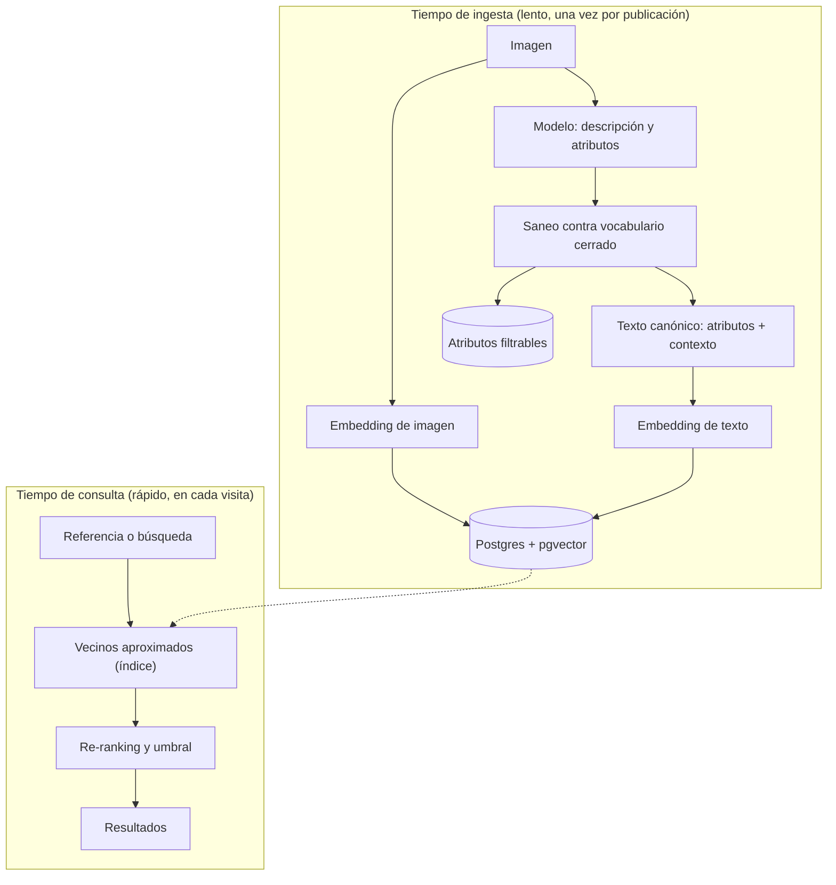
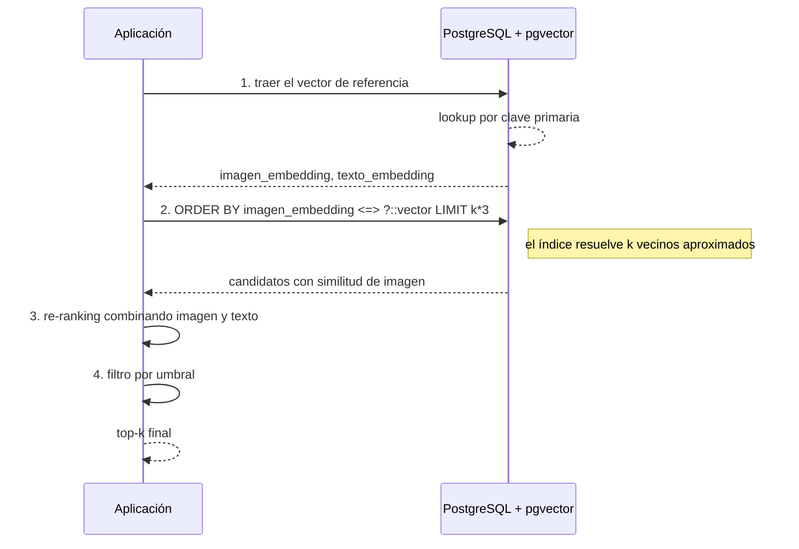
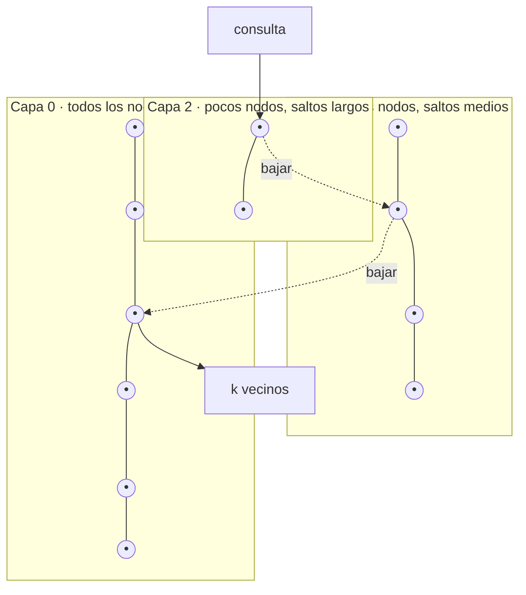

Teníamos que resolver algo que sonaba simple: mostrarte publicaciones parecidas a la que estabas mirando. Un feed lleno de fotos de outfits, y la promesa obvia de "si te gustó esto, mirá esto otro".

La primera versión andaba. Y cada vez que alguien abría una publicación, la base recorría **todas** las demás calculando distancia contra la de referencia, una por una, en cada visita. La consulta comparaba contra una fila que traía por `CROSS JOIN` dentro de un `CASE`, y el planner de Postgres se quedaba sin manera de usar un índice. Con unos pocos miles de publicaciones se aguantaba. Con diez veces más, no.

Lo que más me marcó de ese día no fue el arreglo. Fue darme cuenta de que el problema no tenía absolutamente nada que ver con la inteligencia artificial. Los embeddings estaban perfectos. El modelo estaba perfecto. Lo que estaba mal era una consulta SQL.

Desde entonces pienso la IA en producción de una manera que me ahorró muchos dolores de cabeza, y que se resume en tres ideas que van juntas:

La IA se diseña como un **adaptador especializado**, no como el corazón de tu sistema. Un buen RAG es, antes que nada, ingeniería de datos: vale lo que vale tu enriquecimiento. Y para casi todo lo que vas a construir, la base de datos que ya tenés te alcanza.

Voy a desarrollar las tres con el detalle técnico que a mí me hubiera gustado encontrar cuando empecé: las fórmulas, los operadores, cómo funciona el índice por dentro y dónde están las trampas.


## La IA no es especial. Es un detalle de infraestructura.

Cuando aparece "IA" en un proyecto, la reacción típica es ponerla en el centro. El producto pasa a ser "una app *de IA*", la arquitectura se organiza alrededor del modelo, y de golpe tu lógica de negocio depende de la firma de un SDK de un proveedor que hace seis meses no existía.

Yo hago exactamente lo contrario, y no por gusto estético.

En una arquitectura de puertos y adaptadores (lo que mucha gente busca como "hexagonal") hay una regla de dependencia que no se negocia: **las dependencias apuntan hacia adentro**. El dominio no conoce el mundo exterior; el mundo exterior se adapta al dominio.

Eso significa que tu caso de uso no sabe que existe la IA. Sabe que existe un *puerto*: una interfaz que declara **qué** necesita, sin decir **cómo** se consigue.

```kotlin
// El dominio declara lo que necesita, en su propio vocabulario.
interface DescribirImagenPort {
    fun describir(imagen: Imagen): DescripcionVisual?
}

interface GenerarEmbeddingPort {
    fun embeddingDeImagen(imagen: Imagen): List<Double>?
    fun embeddingDeTexto(texto: String): List<Double>?
}
```

Fijate que en esas firmas no aparece ni el nombre del proveedor, ni un token, ni un modelo, ni un `ChatClient`. Aparece el vocabulario del negocio: imagen, descripción, embedding. Que atrás eso lo resuelva un modelo de Google, uno de OpenAI, uno corriendo en tu propia máquina o un doble de prueba, al caso de uso le da exactamente igual.



El adaptador es el que se ensucia las manos: arma el prompt, maneja el formato de la imagen, interpreta la respuesta, traduce los errores del proveedor a errores de tu dominio. Es una capa de traducción, y su trabajo es que la rareza del mundo exterior no se filtre hacia adentro.

## El puerto que no sabe que hay un modelo atrás

Esta separación me compró cuatro cosas muy concretas, y vale la pena nombrarlas una por una porque son el argumento real.

**Puedo testear el dominio sin gastar un centavo ni depender de la red.** Un test que llama a un modelo de verdad no es un test: es lento, cuesta plata, y —lo peor— no es determinista, porque el mismo prompt puede devolverte algo distinto mañana. Con un doble del puerto, mi caso de uso se prueba en milisegundos:

```kotlin
class DescribirImagenFake(private val respuesta: DescripcionVisual?) : DescribirImagenPort {
    override fun describir(imagen: Imagen) = respuesta
}

// El test verifica MI lógica: qué pasa si el modelo no devuelve nada,
// si devuelve datos fuera de rango, si falla a mitad de camino.
```

Ese último punto es el importante. Lo que yo necesito testear no es si el modelo acierta —eso no lo controlo—, sino **cómo se comporta mi sistema cuando el modelo se equivoca**. Y para eso necesito poder fabricar esas respuestas a voluntad.

**Puedo cambiar de proveedor sin abrir el dominio.** El mercado de modelos se mueve cada pocos meses: cambian los precios, aparecen modelos mejores, alguno se discontinúa. Si tu lógica de negocio importa el SDK del proveedor, cada uno de esos movimientos es una cirugía. Si importa un puerto, es un archivo nuevo y una línea de configuración.

**Puedo correr el mismo caso de uso con dos implementaciones a la vez.** Esto es más útil de lo que parece: te permite comparar modelos con tráfico real, o tener un modelo barato por defecto y uno caro para los casos difíciles, sin tocar una línea del dominio.

**Y puedo aislar la falla.** Acá quiero detenerme, porque es lo que más subestima la gente que recién empieza.

## La IA falla distinto

Una base de datos falla de maneras que ya conocés: se cae, se satura, te da timeout. Un modelo falla de maneras mucho más creativas.

Te puede devolver un JSON con un campo de más. Te puede devolver el campo correcto con un valor absurdo. Te puede tardar treinta segundos. Te puede cortar la respuesta a la mitad porque se quedó sin tokens. Te puede rechazar la petición por límite de frecuencia justo cuando estás procesando un lote grande. Y, la más traicionera: te puede devolver algo perfectamente bien formado y completamente equivocado.

Por eso el adaptador de IA no es solo un traductor. Es **un lugar donde concentrás la desconfianza**.

Hay cuatro defensas que para mí no son opcionales cuando esto sale a producción:

*Idempotencia.* Si ya calculaste el embedding de una publicación, no lo vuelvas a calcular. Suena obvio hasta que un reproceso te duplica la factura. La regla es simple: antes de llamar al modelo, preguntá si el trabajo ya está hecho.

```kotlin
if (yaTieneEmbeddings(publicacionId)) return
```

*Versionado del prompt.* Un prompt es código, y cambia. Si guardás junto al dato con qué versión de prompt lo generaste, podés evolucionar el prompt sin romper lo ya generado, y re-procesar solo cuando de verdad querés:

```kotlin
// Al bumpear la versión, la idempotencia deja de aplicar
// y el contenido viejo se puede regenerar de forma controlada.
const val VERSION_PROMPT = "v1"
```

*Control de frecuencia.* Los proveedores te limitan. Si vas a procesar un lote histórico, hacelo con una pausa entre llamadas, en un proceso aparte, con la posibilidad de cortarlo y retomarlo. Un backfill sin freno es la forma más rápida de que te bloqueen la cuenta a mitad de camino.

*Aislamiento de errores.* Si tu flujo hace tres cosas con IA y la tercera es opcional, que la tercera no se lleve puestas a las otras dos:

```kotlin
try {
    generarMetadatosOpcionales(publicacion)
} catch (e: Exception) {
    log.error("Falló el paso opcional, no bloquea el flujo principal", e)
}
```

Nada de esto es glamoroso. Nada de esto sale en los demos. Es, exactamente, la diferencia entre algo que anda en tu notebook y algo que anda a las tres de la mañana sin que nadie lo mire.

## Que no se pierda el trabajo: el patrón outbox

Hay una falla que no se arregla con ninguna de las cuatro defensas anteriores, y es la más silenciosa de todas.

Pensá el flujo completo. Alguien publica contenido. Vos tenés que hacer dos cosas: guardarlo en tu base, y avisarle al servicio que lo enriquece con IA que hay trabajo nuevo. Dos sistemas distintos —tu base de datos y tu cola de mensajes— y ninguna transacción compartida entre ellos.

Probá los dos órdenes posibles y vas a ver que ninguno cierra.

Si publicás el evento primero y después confirmás la transacción, y la transacción falla, quedó un evento dando vueltas que habla de contenido que no existe. El consumidor lo levanta, no encuentra nada y tira error.

Si confirmás primero y publicás después, y el proceso se muere entre esas dos líneas —un deploy, un reinicio del pod, la cola caída tres segundos—, el contenido quedó guardado y **nunca** se va a enriquecer. Y acá está lo feo: nadie se entera. El usuario ve su publicación bien. No hay error, no hay alerta, no hay excepción. Simplemente ese contenido no tiene etiquetas ni vectores, y por lo tanto no aparece en ninguna búsqueda ni en ninguna recomendación. Lo descubrís dos meses después, cuando alguien pregunta por qué algunas cosas nunca tienen relacionados.

Esto se llama el problema de la escritura dual, y es viejo como los sistemas distribuidos. La tentación es resolverlo con transacciones distribuidas de dos fases. Mi consejo: no vayas por ahí. Son complejas, acoplan los sistemas y andan mal justo cuando más las necesitás.

La salida es mucho más simple, y parte de reconocer una cosa: **el único lugar donde ya tenés transaccionalidad garantizada es tu propia base de datos**.

Entonces no publiquemos nada hacia afuera durante la transacción. Escribamos la *intención* de publicarlo en una tabla, con el mismo commit que guarda el dato:

```sql
-- Esquema ilustrativo
CREATE TABLE outbox (
    id               bigserial PRIMARY KEY,
    tipo             text        NOT NULL,
    payload          jsonb       NOT NULL,
    estado           text        NOT NULL DEFAULT 'pendiente',
    intentos         int         NOT NULL DEFAULT 0,
    proximo_intento  timestamptz NOT NULL DEFAULT now(),
    creado_en        timestamptz NOT NULL DEFAULT now()
);

CREATE INDEX outbox_pendientes
    ON outbox (proximo_intento) WHERE estado = 'pendiente';
```

Y del lado de la aplicación, las dos escrituras viajan juntas:

```kotlin
transaccion {
    publicacionRepo.guardar(publicacion)
    outboxRepo.registrar(
        EventoPendiente(tipo = "publicacion.creada", payload = publicacion.id)
    )
}
// O se guardan las dos cosas, o no se guarda ninguna.
// Lo garantiza la base, no tu código.
```

Después, un proceso aparte —un worker— lee lo pendiente y hace el trabajo lento: llamar al modelo, calcular los vectores, publicar el evento río abajo. Cuando termina bien, marca la fila como procesada.



Fijate lo que cambió: la respuesta al usuario ya no depende del modelo. Guardás, devolvés, y el trabajo caro queda anotado para hacerse enseguida pero afuera del camino crítico. El usuario no espera cinco segundos a que un modelo le describa la foto.

Para leer lo pendiente hay un detalle que separa el ejemplo de blog del código que funciona con más de un worker:

```sql
SELECT * FROM outbox
WHERE estado = 'pendiente'
  AND proximo_intento <= now()
ORDER BY id
LIMIT 50
FOR UPDATE SKIP LOCKED;
```

Ese `FOR UPDATE SKIP LOCKED` es la joya. Bloquea las filas que se lleva y le dice al resto de los workers "estas ya las tomó alguien, seguí de largo". Sin eso, dos instancias del worker levantan las mismas filas y hacen el trabajo dos veces —que en un flujo con IA significa pagar dos veces—. Con eso, podés correr cinco workers en paralelo y se reparten la cola sin coordinarse ni pisarse.

Cuando el intento falla, no se pierde: se incrementa el contador y se reprograma para más adelante, con una espera que crece en cada intento para no castigar a un proveedor que está teniendo un mal día:

$$ \text{espera} = \min\!\left(base \cdot 2^{\,intentos},\; tope\right) + \text{jitter} $$

El *jitter* es un pequeño desvío aleatorio, y está para que mil trabajos que fallaron al mismo tiempo no vuelvan a intentar todos juntos en el mismo instante. Y cuando los intentos pasan de cierto número, la fila se marca como fallida definitiva y va a parar a una cola de descarte, para que alguien la mire con calma en vez de reintentarla para siempre.

Ahora, la parte que hay que decir con honestidad, porque es la contracara del patrón.

El outbox te da entrega **al menos una vez**, no exactamente una vez. El caso es fácil de ver: el worker publica el evento, y se muere justo antes de marcar la fila como procesada. Cuando vuelve, la fila sigue pendiente, y el trabajo se hace de nuevo. Eso no es un defecto de la implementación: es inevitable, porque publicar hacia afuera y marcar adentro tampoco comparten transacción. Movimos el problema a un lugar donde duele mucho menos, pero no lo hicimos desaparecer.

Y por eso el outbox y la idempotencia son el mismo tema. Si tu consumidor puede procesar dos veces el mismo evento sin consecuencias —porque antes de llamar al modelo pregunta si el trabajo ya está hecho—, entonces los duplicados son inofensivos. Sin idempotencia, el outbox te garantiza que el trabajo se hace y también que a veces lo vas a pagar dos veces.

Los otros costos son menores pero existen. La tabla crece, así que hay que borrar o archivar lo procesado. Y si el worker consulta cada pocos segundos, esa es tu latencia mínima. Si esa espera te molesta, la alternativa es leer los cambios directamente del log de la base con captura de cambios (*change data capture*), que es la misma idea sin la consulta periódica.

Termino con lo que más me gusta de este patrón, y que es la tesis del artículo otra vez: el outbox no es un patrón de IA. Es un patrón de sistemas distribuidos de toda la vida, de cuando las colas y las bases no se ponían de acuerdo. Lo que pasa es que un flujo con IA lo vuelve casi obligatorio, porque el trabajo que estás coordinando es lento, cuesta dinero real y falla más seguido que un `INSERT`. La herramienta es nueva; el problema y la solución tienen veinte años.

## Un RAG no es un prompt mágico. Es un pipeline de datos.

Cambiemos de capa. Ya sabemos dónde enchufar el modelo; ahora veamos qué le damos de comer.

RAG —*Retrieval-Augmented Generation*— suele explicarse como "el modelo busca en tus datos y responde". Y toda la atención se va a la segunda mitad: la generación, el prompt, la respuesta bonita.

Para mí el valor está en la primera mitad, la aburrida. **El retrieval es tan bueno como tu enriquecimiento.** Si lo que indexaste no distingue bien una cosa de otra, ningún prompt te va a salvar: el modelo va a redactar con elegancia sobre el contenido equivocado.

Por eso pienso el RAG como un pipeline de datos con dos tiempos bien separados. Uno lento, que corre cuando el contenido entra y lo deja listo para ser encontrado. Y uno rápido, que corre cuando alguien busca.



Separar los dos tiempos es la decisión de arquitectura más importante de todo el RAG. Todo lo caro —llamar al modelo, calcular vectores, normalizar datos— pasa una sola vez, cuando el contenido entra. La búsqueda, que ocurre miles de veces, no llama a ningún modelo: solo mide distancias entre números que ya están guardados.

## Extraer significado, no píxeles

Acá está la parte que más me gusta explicar, porque es donde "semántico" deja de ser una palabra de marketing.

Supongamos que querés guardar los colores dominantes de un outfit para poder filtrar por color. El camino ingenuo es procesar la imagen y sacar un histograma de píxeles: contás cuántos hay de cada tono y te quedás con los más frecuentes.

Ese camino falla de una manera muy específica y muy molesta. Si la foto está sacada contra una pared roja, tu color dominante es el rojo de la pared. Si la persona tiene pelo castaño y mucha piel a la vista, tus colores dominantes son el castaño y el tono de piel. El histograma no tiene ninguna forma de saber qué parte de la imagen es *ropa*, porque no sabe qué es la ropa. Solo ve píxeles.

Un modelo multimodal sí sabe. Y ahí el pedido cambia por completo: no le pido "los colores de la imagen", le pido **los colores dominantes de las prendas y los accesorios, ignorando el fondo, la piel y el pelo**.

Eso es extracción semántica: entender *qué* es cada cosa antes de describirla. El resultado es un dato que significa lo que vos querías que signifique.

Pero dejarlo ahí sería ingenuo, y volvemos a la desconfianza del adaptador. Si le pedís colores a un modelo en texto libre, te va a devolver cosas como "azul petróleo", "azulado", "navy" y "#1B3A5C" para lo que es, a los fines de tu buscador, exactamente el mismo azul. Tu filtro se vuelve inútil no por falta de datos, sino por exceso de vocabulario.

La solución que uso es un **vocabulario cerrado**: una lista fija de valores canónicos que el modelo tiene que elegir, con la instrucción de que si algo no encaja exacto, elija el más cercano de la lista.

```kotlin
// El modelo propone; el dominio dispone.
// Todo lo que no esté en el vocabulario canónico se descarta acá
// y nunca llega a la base.
val coloresValidos = respuesta.colores.filter { it in VOCABULARIO_CANONICO }
```

Ese filtro del lado nuestro es el detalle que separa un prototipo de un sistema. El prompt *pide* que respete la lista; el código **garantiza** que la respeta. Si algún día el modelo cambia de humor, inventa un valor o alucina un formato, el dato sucio muere en tu frontera y no te contamina la base para siempre.

Y no es solo defensa: al forzar un vocabulario cerrado estás haciendo, sin darte cuenta, lo que en modelado de dominio llamaríamos definir un tipo. "Color" deja de ser un string arbitrario y pasa a ser un conjunto finito y conocido. Podés indexarlo, contarlo, filtrarlo y mostrarlo como botones en la interfaz.

## Las palabras que eligen a quién se parecen

Con las etiquetas de texto pasa algo parecido, pero el criterio es más sutil y me costó entenderlo.

La intuición dice: cuanto más preciso el tag, mejor. Y es falso. Si le pedís al modelo etiquetas muy específicas, te devuelve joyas como "camisa de lino color arena con botones de nácar", y esa etiqueta es tan única que **no se va a parecer a nada**. Un tag que aparece en una sola publicación no sirve para relacionar: sirve para describir, que es otra cosa.

Como esas palabras existen para *conectar* contenidos entre sí, tienen que estar en el punto medio: suficientemente específicas para significar algo, suficientemente generales para repetirse. "Camisa", "lino", "beige", "minimalista" conectan; la frase completa, no.

La regla que me quedó: **las etiquetas no describen el contenido, describen su vecindario.**

Después, ese texto canónico se combina antes de vectorizarlo. No embebo solo las etiquetas: armo un texto que junta las etiquetas con el contexto que ya tengo en la base —el título, quién lo publicó, qué productos aparecen—, porque todo eso aporta significado que la imagen sola no tiene.

```kotlin
val textoParaEmbeber = listOfNotNull(
    titulo, autor, nombresDeProductos, etiquetas.joinToString(" ")
).filter { it.isNotBlank() }
```

## Qué es realmente un embedding

Ahora sí, los números.

Un embedding no es magia: es una función que lleva un objeto —un texto, una imagen— a un punto en un espacio de muchas dimensiones.

$$ f(x) = \mathbf{v} \in \mathbb{R}^{n} $$

La propiedad que hace que todo esto funcione es que esa función se entrenó para que **la cercanía en el espacio corresponda a la cercanía en el significado**. Dos fotos de outfits parecidos caen cerca. Dos textos que hablan de lo mismo caen cerca. Y no hace falta que compartan una sola palabra: "auto" y "vehículo" no tienen letras en común, pero sus vectores son casi el mismo punto.

Esa es la diferencia de fondo con la búsqueda de texto clásica. Un `LIKE '%auto%'` busca la cadena. Un embedding busca la idea.

El número de dimensiones $n$ depende del modelo que uses. En un caso real con el que trabajé, las imágenes salían en $\mathbb{R}^{1408}$ y los textos en $\mathbb{R}^{768}$. No son números que elijas vos: vienen con el modelo, y tienen dos consecuencias muy prácticas.

La primera es que ocupan lugar. Un vector de 1408 dimensiones en punto flotante de 4 bytes son unos 5,6 KB por fila, solo para esa columna. Con cien mil filas ya son cientos de megabytes. No es dramático, pero es algo que hay que tener en la cabeza antes de que te sorprenda.

La segunda, y más importante: **dos vectores de modelos distintos no se pueden comparar entre sí**. Un vector de imagen de 1408 dimensiones y uno de texto de 768 no viven en el mismo espacio; ni siquiera tienen la misma cantidad de ejes. No hay forma de medir distancia entre ellos. Esto tiene una consecuencia de diseño enorme que vemos más adelante, cuando queramos combinar las dos señales.

Y una advertencia que te va a ahorrar una noche de depuración: si cambiás de modelo de embeddings, **todos tus vectores viejos quedan inservibles**. No están "un poco desactualizados": están en otro espacio. Hay que recalcular todo. Por eso conviene guardar junto al vector qué modelo lo generó, igual que guardás la versión del prompt.

## Medir parecido: los tres operadores

Si buscar es medir distancia entre vectores, la pregunta siguiente es: ¿qué distancia? Porque hay varias, y no dan lo mismo.

La **distancia euclídea** (L2) es la que aprendiste en la escuela: la longitud de la línea recta entre dos puntos.

$$ d_{L2}(\mathbf{a}, \mathbf{b}) = \lVert \mathbf{a} - \mathbf{b} \rVert = \sqrt{\sum_{i=1}^{n} (a_i - b_i)^2} $$

El **producto interno** es la suma de los productos componente a componente. Cuanto más grande, más alineados y más grandes son los vectores.

$$ \mathbf{a} \cdot \mathbf{b} = \sum_{i=1}^{n} a_i b_i $$

Y la **similitud del coseno** mide el ángulo entre los dos vectores, ignorando cuán largos son:

$$ \text{sim}(\mathbf{a}, \mathbf{b}) = \cos(\theta) = \frac{\mathbf{a} \cdot \mathbf{b}}{\lVert \mathbf{a} \rVert \, \lVert \mathbf{b} \rVert} $$

¿Por qué para significado casi siempre querés el coseno? Porque en un embedding **la dirección lleva el significado y la magnitud lleva sobre todo la intensidad**. Un texto largo y uno corto sobre el mismo tema apuntan hacia el mismo lado, pero el largo suele tener mayor magnitud. Si medís con euclídea, el texto largo "se aleja" del corto aunque signifiquen lo mismo. El coseno los ve juntos, que es lo que querés.

En pgvector, cada una tiene su operador:

| Operador | Qué mide | Rango | Cuándo lo querés |
|---|---|---|---|
| `<->` | Distancia euclídea (L2) | 0 a infinito | Cuando la magnitud importa de verdad (coordenadas, señales) |
| `<#>` | Producto interno negativo | Sin acotar | Vectores ya normalizados, o cuando querés premiar magnitud |
| `<=>` | Distancia coseno | 0 a 2 | Significado. El caso normal con embeddings |

Ojo con un detalle que confunde a todo el mundo: `<=>` devuelve **distancia**, no similitud. Son complementarias. Distancia cero quiere decir ángulo cero, es decir, máximo parecido. Por eso la similitud sale como:

$$ \text{similitud} = 1 - (\mathbf{a} \mathbin{<\!=\!>} \mathbf{b}) $$

Y un atajo que conviene conocer: si **normalizás** los vectores al guardarlos, es decir si los llevás a longitud 1,

$$ \hat{\mathbf{a}} = \frac{\mathbf{a}}{\lVert \mathbf{a} \rVert} $$

entonces ordenar por coseno y ordenar por producto interno dan exactamente el mismo orden, y el producto interno es más barato de calcular porque se ahorra las raíces. Es una optimización real, pero solo si controlás que *todo* lo que entra está normalizado. Si se te cuela un vector sin normalizar, los resultados se ensucian en silencio, que es la peor forma de romperse.

## Postgres te alcanza. En serio.

Acá viene la opinión que más discusiones me trae.

Cuando alguien dice "búsqueda vectorial", medio mundo sale corriendo a instalar una base de datos vectorial dedicada. Y en la enorme mayoría de los proyectos —incluidos productos vivos con usuarios reales— **la base que ya tenés te alcanza**.

Con la extensión pgvector, Postgres gana un tipo de dato `vector` y los operadores de arriba. Los embeddings viven en la misma tabla que el resto de los datos, y eso tiene una ventaja que las bases vectoriales dedicadas no te dan fácil: podés combinar búsqueda semántica con filtros de negocio comunes en la misma consulta, con las mismas transacciones y los mismos backups.

Guardar es un `UPDATE` con un casteo:

```sql
-- Esquema ilustrativo
ALTER TABLE publicacion ADD COLUMN imagen_embedding vector(1408);
ALTER TABLE publicacion ADD COLUMN texto_embedding  vector(768);

UPDATE publicacion
SET imagen_embedding = ?::vector,
    texto_embedding  = ?::vector
WHERE id = ?;
```

Del lado de la aplicación, el vector viaja como texto con el formato `[0.013,-0.221,...]` y Postgres lo castea. Nada exótico.

Y antes de que alguien lo pregunte: no, una base vectorial dedicada no es una mala idea. Es una idea para *después*. Cuando tengas decenas de millones de vectores, necesidades de sharding o requisitos de latencia muy finos, va a tener sentido. Migrar a ese punto es un problema bueno de tener. Arrancar ahí, cuando tenés unos miles de filas y ninguna certeza sobre el producto, es pagar complejidad por adelantado con plata que todavía no ganaste.

## El día que entendí que el índice no se usa solo

Volvamos a la escena del principio, porque ahora tiene nombre.

Agregar la columna `vector` y usar el operador correcto no te da velocidad. Te da *resultados correctos*, lentamente. Si le pedís a Postgres que ordene por distancia y no hay un índice vectorial, va a hacer un **seq scan**: calcular la distancia contra cada fila de la tabla, ordenar todo, y recién ahí quedarse con las primeras. Con mil filas ni lo notás. Con cien mil, se te cae el feed.

El primer paso es crear el índice. El segundo —el que a mí me costó una tarde— es escribir la consulta de la forma exacta que el planner reconoce.

Esto **no** usa el índice:

```sql
-- El vector de referencia se resuelve dentro de la misma consulta.
-- El planner no puede tratar la expresión como una constante:
-- termina calculando distancia contra toda la tabla.
SELECT c.id
FROM publicacion c
CROSS JOIN (SELECT imagen_embedding FROM publicacion WHERE id = ?) ref
ORDER BY c.imagen_embedding <=> ref.imagen_embedding
LIMIT 10;
```

Esto sí:

```sql
-- El vector de referencia se trae en una consulta aparte
-- y entra como parámetro. Ahora el ORDER BY ... LIMIT es un
-- "k vecinos más cercanos" que el índice sabe resolver.
SELECT c.id,
       1 - (c.imagen_embedding <=> ?::vector) AS similitud
FROM publicacion c
WHERE c.id != ?
  AND c.imagen_embedding IS NOT NULL
ORDER BY c.imagen_embedding <=> ?::vector
LIMIT ?;
```

Mismo operador, mismos datos, mismo resultado. Dos consultas y un parámetro de diferencia. Y un abismo de rendimiento.

La forma `ORDER BY columna <=> parámetro LIMIT k` es el patrón que el índice entiende. Cualquier cosa que impida que el vector de referencia sea una constante para el planner —un join, un `CASE`, una subconsulta correlacionada— te devuelve al seq scan sin avisarte. Fijate que la consulta sigue dando el resultado correcto: por eso es tan fácil que se te pase en desarrollo y te explote cuando crecés.

Mi consejo práctico: cuando trabajes con vectores, **hacé `EXPLAIN` de la consulta antes de darla por buena**. Si ves un `Seq Scan` donde esperabas un `Index Scan`, tenés el problema ahí, a la vista.



## HNSW por dentro (y las tres perillas que importan)

El índice que uso para esto se llama HNSW, por *Hierarchical Navigable Small World*. El nombre asusta más que la idea.

Pensalo como un mapa de rutas en capas. En la capa de más arriba hay pocos nodos conectados por "autopistas" que cruzan grandes distancias. En cada capa hacia abajo hay más nodos y las conexiones son más cortas y más locales. Para buscar, entrás por arriba, te movés en saltos grandes hacia la zona correcta, bajás una capa, refinás, y así hasta la capa del fondo, donde te movés con precisión entre vecinos cercanos.



En vez de mirar todos los puntos, mirás un camino. Por eso la búsqueda pasa de costo lineal a algo que en la práctica se comporta como logarítmico:

$$ O(N) \;\longrightarrow\; O(\log N) $$

Eso tiene un precio, y hay que decirlo con todas las letras: **HNSW es aproximado**. No te garantiza los k vecinos más cercanos de verdad; te da los k que encontró recorriendo el grafo. En la práctica acierta casi siempre, pero "casi" no es "siempre".

Esa calidad se mide con *recall*: de los k vecinos verdaderos, cuántos te devolvió.

$$ \text{recall@}k = \frac{|\, \text{devueltos} \cap \text{verdaderos} \,|}{k} $$

Y se ajusta con tres perillas:

`m` es cuántas conexiones tiene cada nodo. Más conexiones, grafo mejor comunicado y más recall, pero el índice ocupa más y tarda más en construirse. Se define al crear el índice y no se cambia después sin reconstruirlo.

`ef_construction` es cuánto se esfuerza el algoritmo en encontrar buenos vecinos **mientras construye** el índice. Más alto, mejor grafo, construcción más lenta. También se fija al crear.

`ef_search` es cuántos candidatos explora **en cada búsqueda**. Esta es la única que podés mover en caliente, y es la que de verdad vas a tocar: es el dial directo entre recall y latencia.

```sql
CREATE INDEX publicacion_imagen_embedding_hnsw
    ON publicacion USING hnsw (imagen_embedding vector_cosine_ops);

-- Ajuste por sesión: más alto = mejor recall, más latencia.
SET hnsw.ef_search = 40;
```

El `vector_cosine_ops` del final no es decorativo, y es un error clásico: **la clase de operadores del índice tiene que coincidir con el operador de la consulta**. Si construís el índice para coseno y después consultás con `<->`, el índice no se usa y volvés al seq scan. Para L2 la clase es `vector_l2_ops`, para producto interno `vector_ip_ops`.

Dos apuntes operativos. Existe otro tipo de índice, IVFFlat, que agrupa los vectores en listas y busca solo en las más prometedoras: se construye mucho más rápido y ocupa menos, pero suele dar peor relación recall/latencia y —detalle importante— necesita que ya haya datos representativos en la tabla cuando lo creás. HNSW se banca una tabla que crece desde cero, que es el caso normal. Y si la tabla ya es grande y está en producción, creá el índice con `CONCURRENTLY` para no bloquear escrituras, teniendo en cuenta que esa variante no puede correr dentro de una transacción.

## Dos espacios, un solo resultado

Volvamos al problema que dejé abierto: cada publicación tiene dos vectores, uno de la imagen y uno del texto, y viven en espacios distintos que no se pueden comparar entre sí.

La tentación es concatenarlos en un solo vector grande. No funciona: estarías sumando ejes que no tienen ninguna relación entre sí, y la distancia resultante no significa nada. Tampoco sirve promediarlos, por la misma razón.

Lo que sí funciona es medir **por separado y combinar los puntajes**, no los vectores.

$$ \text{score} = w_{img} \cdot \text{sim}_{img} + w_{txt} \cdot \text{sim}_{txt} \qquad \text{con } w_{img} + w_{txt} = 1 $$

Pero acá aparece un problema práctico. El índice ordena por *una* columna. Si pido los 10 mejores por imagen y después re-ordeno combinando con el texto, puede que el que hubiera quedado primero con el puntaje combinado estuviera en el puesto 15 por imagen, y nunca lo traje.

La solución estándar se llama **over-fetch**: traés más candidatos de los que necesitás y re-ordenás sobre ese conjunto más grande.

```kotlin
// Traigo el triple de lo que voy a devolver.
val overFetch = (limite * 3).coerceAtLeast(limite)

val score = when {
    tieneImagen && tieneTexto -> simImagen * 0.7 + simTexto * 0.3
    tieneImagen -> simImagen
    else -> simTexto
}

val resultado = candidatos
    .map { it.id to score(it) }
    .filter { it.second >= umbral }
    .sortedByDescending { it.second }
    .take(limite)
```

El factor 3 es un equilibrio: suficiente margen para que el re-ranking tenga con qué trabajar, sin traer tanto que la consulta se vuelva cara. Es una perilla más, y se ajusta mirando resultados.

Sobre los pesos: en un dominio visual como la moda la imagen manda, porque la gente entra por los ojos. El texto desempata cuando dos cosas se parecen de lejos pero hablan de cosas distintas. La proporción exacta no salió de ningún paper: salió de mirar resultados, ajustar, y volver a mirar. Eso también es el trabajo, y no tiene nada de glamoroso.

Y el **umbral** merece su párrafo. Sin umbral, siempre devolvés k resultados, aunque el mejor candidato se parezca poquísimo. Con umbral, a veces devolvés menos, o ninguno. **Devolver menos resultados buenos es mejor que llenar la pantalla con resultados malos**: el usuario no sabe cuántos había, pero sí se da cuenta cuando lo que le mostrás no tiene nada que ver.

## Si tus datos son documentos y no fotos

Todo lo anterior vale igual si en vez de imágenes tenés documentos, que es el caso más común de RAG. Cambia una sola cosa, pero es grande: **el troceado**.

Un documento de cuarenta páginas no se embebe entero. Primero, porque el modelo tiene un límite de entrada. Y segundo, más importante: un vector que resume cuarenta páginas no se parece a nada en particular. Queda en el centro de todo y no distingue.

Así que se corta en trozos, y el tamaño del trozo es la decisión clave. Trozos muy chicos pierden contexto —una oración suelta no dice de qué capítulo salió—. Trozos muy grandes vuelven al problema del promedio. En el medio, se suele usar un solapamiento entre trozos consecutivos para que una idea que cae justo en el borde no quede partida en dos.

Y hay algo que se subestima mucho: **conviene guardar, junto al trozo, de dónde salió**. Documento, sección, página. No es solo para citar la fuente en la respuesta, que ya sería razón suficiente; es para poder depurar. Cuando el sistema devuelva algo raro —y lo va a hacer—, vas a querer saber qué trozo recuperó y de dónde vino. Sin esa trazabilidad, estás adivinando.

El resto —puerto, adaptador, enriquecimiento, vocabulario controlado, operador correcto, índice, over-fetch, umbral— es idéntico.

## Y el MCP, ¿dónde entra?

Una nota corta para cerrar el círculo, porque me lo van a preguntar.

Hasta acá el modelo fue una función: le das algo, te devuelve algo. Pero los modelos también pueden *pedir* cosas: "para responder esto necesito consultar tal dato". A eso se le dice tool calling, y le das al modelo un conjunto de herramientas que puede invocar.

Si te fijás, una herramienta es exactamente lo mismo que veníamos discutiendo: un contrato que dice **qué** puede hacer el modelo, sin exponerle cómo está hecho. Es un puerto, visto desde el otro lado.

MCP —*Model Context Protocol*— es ese mismo límite, estandarizado como protocolo, para que una herramienta la pueda usar cualquier modelo sin acoplarse a tu código. La idea de fondo no es nueva en absoluto: es una frontera limpia entre tu dominio y el mundo, que es de lo que veníamos hablando todo el artículo.

Y como toda frontera, el diseño importa más que la implementación. Una herramienta que expone demasiado es un problema de seguridad; una que expone de menos obliga al modelo a adivinar. Ahí hay material para un artículo entero, así que lo dejo picando.

## Lo que me llevo

Si tuviera que resumir todo esto en una sola idea, sería esta: **la IA en producción se parece mucho menos a la ciencia ficción y mucho más a lo que ya sabés hacer.**

Interfaces limpias, para que el modelo sea reemplazable. Datos prolijos y vocabularios controlados, para que lo que indexás signifique algo. Desconfianza sana en la frontera, porque el modelo falla distinto. Y una consulta bien escrita contra un índice bien elegido, que es ingeniería de bases de datos de toda la vida.

El modelo es la parte fácil. Es, literalmente, una llamada HTTP. Todo lo demás —dónde lo enchufás, con qué lo alimentás, dónde guardás lo que produce y cómo lo encontrás rápido— es el oficio de siempre, aplicado a un juguete nuevo.

Por eso me parece que este momento favorece a la gente que tiene la base sólida más que a la que corre atrás de la herramienta del mes. El concepto le gana a la herramienta, otra vez.

Si estás metiendo IA en un producto tuyo, te dejo la pregunta que a mí me ordenó todo: **¿tu lógica de negocio sabe que hay un modelo atrás, o le da igual?** Contame cómo lo resolviste —o por qué elegiste no separarlo—, que ahí es donde se aprende de verdad.
